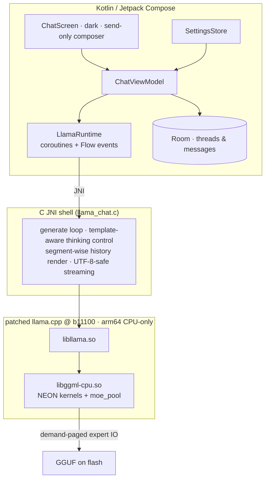

# edge0-android — Release Build Guide

English | [中文](README_zh.md) | [日本語](README_ja.md) | [Español](README_es.md) | [Français](README_fr.md)

This document is for **developers building or evaluating the Android app from source**. It covers: quick start (engine → app → models → test), measured performance on the reference device, and the technical choices behind the stack.

edge0 is published as a **monorepo** — [`Edge0-AI/edge0`](https://github.com/Edge0-AI/edge0) — whose top level holds the shared engine supply (`vendor.llama.pin` + the scripts-materialized `vendor/llama.cpp`, `patches/llama.cpp/` band-sets) and the platform subprojects (`windows/` = the desktop companion, `android/` = this app). Inference runs on pinned upstream llama.cpp, patched as a replayable patch set, fully on-CPU with ARM-NEON kernels and a demand-paged expert pool.

Third-party attribution: see `NOTICE` in this directory. Model cards: [Edge0/Edge0-8B-A1B-preview](https://huggingface.co/Edge0/Edge0-8B-A1B-preview) · [Edge0/Edge0-35B-A3B-preview](https://huggingface.co/Edge0/Edge0-35B-A3B-preview).

---

## 1. Quick Start

### 1.1 Prerequisites

| component | requirement |
|---|---|
| Device | arm64-v8a, Android 13+ (API 33); Snapdragon 8 Elite class recommended |
| RAM | 8 GB+ runs 8B; 12–16 GB runs 35B (expert paging, see §3.2) |
| Toolchain | JDK 17+, Android SDK 35, **NDK r28** (`28.2.13676358`), CMake ≥ 3.21 + Ninja |
| Python | 3.10+ with `numpy` (model converter, runs from the sibling `windows/tools`) |
| Disk | ≥ 30 GB free for model sources and converted GGUF builds |

The NDK is **not** part of this repository — install it once (Android Studio:
*Android SDK → SDK Tools → NDK (Side by side)*, or via CLI):

```bash
sdkmanager --install "ndk;28.2.13676358"
```

Then point the build at it with `NDK_DIR` (or an exported `ANDROID_NDK_HOME`):
`build_vendor_libs.sh` reads the compiler toolchain **and** the `libomp.so`
runtime it stages (§1.2) from inside that NDK installation; a missing NDK
fails fast with that hint rather than producing a broken library set.

### 1.2 Build the engine

The native libraries come from the pinned upstream tree with this platform's
patch bands replayed into an isolated worktree — the vendor tree is **never
patched in place**:

```bash
git clone https://github.com/Edge0-AI/edge0
cd edge0/android
bash tools/llama/build_vendor_libs.sh
```

The script replays `../patches/llama.cpp/{common,android}` (6 + 14 bands) onto
the pinned llama.cpp tree — the pin lives in `../vendor.llama.pin` (currently
`7ab4ee7`, tag b11100); the tree is **not** a submodule, so on first run it is
cloned from upstream into `../vendor/llama.cpp` (gitignored; set
`EDGE0_LLAMA_URL` to use a mirror) and detached at the pin. Replays happen in a
gitignored consumer worktree, the script
asserts the golden result-tree hash, and produces the four engine shared
libraries (plus the NDK `libomp.so` runtime that `libggml-cpu` needs) with
headers into `build-dl/llama-libs/` (the app's jniLibs staging point).
`--replay` re-applies the bands after patch changes; mismatched tree ⇒ RED, the
build refuses to start. This step is required once before the app build —
the Gradle plugin reads these libraries from `build-dl/llama-libs/`.

### 1.3 Build & install the app

```bash
./gradlew :app:assembleDebug
./gradlew :app:installDebug        # or adb install -r app/build/outputs/apk/debug/app-debug.apk
```

### 1.4 Models

GGUF builds are produced locally from the published checkpoints — everything
stays under this directory's `models/` (gitignored):

```bash
huggingface-cli download Edge0/Edge0-8B-A1B-preview --local-dir models/edge0-8b
python ../windows/tools/convert_mlx_to_gguf.py --dir models/edge0-8b
#  → models/edge0-8b-gguf/{edge0-8b.gguf, lora_edge0_8b-gguf.gguf, manifest.json}

huggingface-cli download Edge0/Edge0-35B-A3B-preview --local-dir models/edge0-35b
python ../windows/tools/convert_mlx_to_gguf.py --dir models/edge0-35b

bash tools/model/push_models.sh --all    # md5-gated staging onto the device
```

The converter needs only python3 + numpy (no MLX/torch runtime — "MLX" denotes
the on-disk checkpoint layout). It runs the r3 repack with numeric parity gates
and emits a sha256 manifest; a correct conversion reproduces the baseline
checksums listed in `push_models.sh` byte-for-byte. Models can also be copied
into `files/models/` with the in-app picker.

### 1.5 Run

Launch **Edge0 Chat**. The title bar shows the active model (8B / 35B), the
top-right button switches. The composer is send-only; temperature, thinking and
the system prompt live in the drawer settings. Each reply carries an inline
metrics line: `tokens · TTFT · prefill t/s · decode t/s · RSS`.

### 1.6 Test it

Instrumented regression (needs both models staged — reinstalling the test APK
wipes app data, so restage right before the run):

```bash
./gradlew :app:installDebugAndroidTest
bash tools/model/push_models.sh --all
adb shell am instrument -w -e class dev.edge0.runtime.app.LlamaRuntimeTest \
  dev.edge0.runtime.app.test/androidx.test.runner.AndroidJUnitRunner
# expected: OK (8 tests), ~7 min on the reference device
```

Coverage: 8B/35B smoke, 35B↔8B in-process switching, prefix-reuse fidelity,
thinking on/off × system-prompt quadrants (8B gate + 35B off leak probe), and
identity retention across multi-turn rendering. Host-side logic tests:
`./gradlew :app:testDebugUnitTest` (26 tests, no device needed).

---

## 2. Performance

Reference device: **Lenovo TB322FC (Snapdragon 8 Elite, 16 GB RAM)**, shipping
config, sustained windows (first segments = boost clocks, tail = thermal steady
state — both reported rather than cherry-picked peaks).

| Model | TTFT (warm turn) | Decode | Prefill | Session RSS |
|---|---:|---:|---:|---:|
| **8B** (Q8-class GGUF + LoRA) | ≈ 1.4 s | 29–32 → ~10 t/s over a 480 s window | ~100 t/s | ≈ 250 MB |
| **35B** (mixed int8 MoE, demand-paged) | ≈ 1.1 s warm (≈ 10–15 s on the very first turn of a new topic — cold expert pool, flash-bound) | 6–9 t/s in-app (9.46 t/s sustained CLI) | ~1 s per incremental turn | pool budget 2–6 GB; resident ≪ file size |

Notes: "first turn of a new topic" pays the cold-pool tax — e.g. a 55-token
question measured prefill 12.8 s with 25956 expert loads, 73 % of wall time in
flash I/O wait; that is demand paging working as designed, not a regression.
Turn two onwards is warm: KV prefix reuse + keepwarm refill bring TTFT to ~1 s.
Decode decay along a long window is DVFS/thermal behavior on this SoC.

---

## 3. Technical Details

### 3.1 Architecture



### 3.2 Why a 21.7 GB MoE fits on a phone — `moe_pool`

The 35B model activates only a moving subset of its 256-per-layer experts per
token, so the shipped design pages experts **on demand** from flash instead of
resident memory (`ggml/src/ggml-cpu/moe_pool.c`, developed as the 14-patch
android band): copy-in private frames, an equal-slot state machine, background
IO staging queues tuned to measured UFS throughput, pin/blob/trim controls, a
turn-end keepwarm refill within a byte budget, and full cross-model reset
enabling 8B↔35B switching inside one process. With the pool disabled the engine
resolves expert rows exactly like upstream (NULL resolver ⇒ zero perturbation,
verified by symbol-set diffing). This is the same mechanism family the desktop
project implements over NVMe + Vulkan; here it is CPU/NEON by design — GPU
backends stay out of the shipping config for deterministic numerics and a
single memory model.

### 3.3 Repo map

```
app/                     Android app: Compose UI (src/main/java), JNI shell (src/main/cpp),
                         instrumented + unit tests (src/androidTest, src/test)
tools/llama/             build_vendor_libs.sh — engine rebuild from the pinned tree + bands
tools/model/             push_models.sh — md5-gated model staging to devices
../vendor/llama.cpp/     materialized by the build scripts from vendor.llama.pin (gitignored; never patched in place)
../patches/llama.cpp/    common(6) + android(14) hook-point bands + ledger README
../windows/              desktop companion — hosts the MLX→GGUF converter used in §1.4
```
