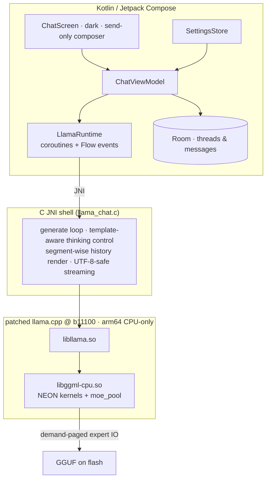

# edge0-android — Guía de compilación de release

[English](README.md) | [中文](README_zh.md) | [日本語](README_ja.md) | Español | [Français](README_fr.md)

Este documento está dirigido a **desarrolladores que compilan o evalúan la aplicación de Android desde el código fuente**. Cubre: inicio rápido (motor → aplicación → modelos → pruebas), rendimiento medido en el dispositivo de referencia y las decisiones técnicas detrás del stack.

edge0 se publica como **monorepo** — [`Edge0-AI/edge0`](https://github.com/Edge0-AI/edge0) — cuyo nivel superior contiene el suministro compartido del motor (`vendor.llama.pin` + el `vendor/llama.cpp` materializado por los scripts, los conjuntos de bandas de `patches/llama.cpp/`) y los subproyectos de plataforma (`windows/` = el complemento de escritorio, `android/` = esta aplicación). La inferencia se ejecuta sobre una versión fijada (pin) de llama.cpp upstream, parcheada como un conjunto de parches reejecutable, totalmente en CPU con kernels ARM-NEON y un pool de expertos paginado bajo demanda.

Atribución de terceros: consulta `NOTICE` en este directorio. Fichas de modelo: [Edge0/Edge0-8B-A1B-preview](https://huggingface.co/Edge0/Edge0-8B-A1B-preview) · [Edge0/Edge0-35B-A3B-preview](https://huggingface.co/Edge0/Edge0-35B-A3B-preview).

---

## 1. Inicio rápido

### 1.1 Requisitos previos

| componente | requisito |
|---|---|
| Dispositivo | arm64-v8a, Android 13+ (API 33); se recomienda un Snapdragon 8 Elite o similar |
| RAM | 8 GB+ ejecuta 8B; 12–16 GB ejecuta 35B (paginación de expertos, ver §3.2) |
| Toolchain | JDK 17+, Android SDK 35, **NDK r28** (`28.2.13676358`), CMake ≥ 3.21 + Ninja |
| Python | 3.10+ con `numpy` (conversor de modelos, se ejecuta desde el `windows/tools` hermano) |
| Disco | ≥ 30 GB libres para las fuentes de los modelos y las compilaciones GGUF convertidas |

El NDK **no** forma parte de este repositorio — instálalo una vez (Android Studio:
*Android SDK → SDK Tools → NDK (Side by side)*, o mediante CLI):

```bash
sdkmanager --install "ndk;28.2.13676358"
```

Después apunta la compilación hacia él con `NDK_DIR` (o una variable `ANDROID_NDK_HOME`
exportada): `build_vendor_libs.sh` lee la toolchain del compilador **y** el runtime
`libomp.so` que prepara (§1.2) desde dentro de esa instalación del NDK; si falta el NDK,
falla rápidamente con esa indicación en lugar de producir un conjunto de bibliotecas
defectuoso.

### 1.2 Compilar el motor

Las bibliotecas nativas provienen del árbol upstream fijado con las bandas de parches de
esta plataforma reejecutadas en un worktree aislado — el árbol del vendor **nunca** se
parchea in situ:

```bash
git clone https://github.com/Edge0-AI/edge0
cd edge0/android
bash tools/llama/build_vendor_libs.sh
```

El script reejecuta `../patches/llama.cpp/{common,android}` (6 + 14 bandas) sobre el árbol
fijado de llama.cpp — el pin está en `../vendor.llama.pin` (actualmente `7ab4ee7`, tag
b11100); el árbol **no** es un submódulo, así que en la primera ejecución se clona desde
upstream en `../vendor/llama.cpp` (ignorado por git; establece `EDGE0_LLAMA_URL` para usar
un mirror) y se hace detach en el pin. Las reejecuciones ocurren en un worktree consumidor
ignorado por git, el script verifica el hash golden del árbol de resultado y produce las
cuatro bibliotecas compartidas del motor (más el runtime `libomp.so` del NDK que
`libggml-cpu` necesita) con las cabeceras en `build-dl/llama-libs/` (el punto de
preparación de jniLibs de la aplicación). `--replay` vuelve a aplicar las bandas tras
cambios en los parches; árbol discordante ⇒ ROJO, la compilación se niega a empezar. Este
paso es necesario una vez antes de compilar la aplicación — el plugin de Gradle lee estas
bibliotecas desde `build-dl/llama-libs/`.

### 1.3 Compilar e instalar la aplicación

```bash
./gradlew :app:assembleDebug
./gradlew :app:installDebug        # or adb install -r app/build/outputs/apk/debug/app-debug.apk
```

### 1.4 Modelos

Las compilaciones GGUF se producen localmente a partir de los checkpoints publicados —
todo permanece en el `models/` de este directorio (ignorado por git):

```bash
huggingface-cli download Edge0/Edge0-8B-A1B-preview --local-dir models/edge0-8b
python ../windows/tools/convert_mlx_to_gguf.py --dir models/edge0-8b
#  → models/edge0-8b-gguf/{edge0-8b.gguf, lora_edge0_8b-gguf.gguf, manifest.json}

huggingface-cli download Edge0/Edge0-35B-A3B-preview --local-dir models/edge0-35b
python ../windows/tools/convert_mlx_to_gguf.py --dir models/edge0-35b

bash tools/model/push_models.sh --all    # md5-gated staging onto the device
```

El conversor solo necesita python3 + numpy (sin runtime MLX/torch — «MLX» denota la
disposición en disco del checkpoint). Ejecuta el reempaquetado r3 con puertas de paridad
numérica y emite un manifiesto sha256; una conversión correcta reproduce byte a byte las
sumas de verificación de referencia listadas en `push_models.sh`. Los modelos también se
pueden copiar a `files/models/` con el selector de la aplicación.

### 1.5 Ejecución

Inicia **Edge0 Chat**. La barra de título muestra el modelo activo (8B / 35B), el botón
superior derecho lo cambia. El compositor solo envía; la temperatura, el thinking y el
system prompt están en los ajustes del panel lateral. Cada respuesta lleva una línea de
métricas integrada: `tokens · TTFT · prefill t/s · decode t/s · RSS`.

### 1.6 Probarlo

Regresión instrumentada (requiere ambos modelos preparados — reinstalar el APK de prueba
borra los datos de la aplicación, así que vuelve a prepararlos justo antes de la
ejecución):

```bash
./gradlew :app:installDebugAndroidTest
bash tools/model/push_models.sh --all
adb shell am instrument -w -e class dev.edge0.runtime.app.LlamaRuntimeTest \
  dev.edge0.runtime.app.test/androidx.test.runner.AndroidJUnitRunner
# expected: OK (8 tests), ~7 min on the reference device
```

Cobertura: smoke de 8B/35B, cambio en el proceso 35B↔8B, fidelidad de la reutilización de
prefijos, cuadrantes de thinking activado/desactivado × system prompt (puerta 8B + prueba
de fuga con 35B desactivado) y retención de identidad en el renderizado multiturno.
Pruebas de lógica del lado del host: `./gradlew :app:testDebugUnitTest` (26 pruebas, sin
necesidad de dispositivo).

---

## 2. Rendimiento

Dispositivo de referencia: **Lenovo TB322FC (Snapdragon 8 Elite, 16 GB de RAM)**,
configuración de serie, ventanas sostenidas (los primeros segmentos = relojes de boost, la
cola = estado estacionario térmico — se reportan ambos en lugar de picos seleccionados a
dedo).

| Modelo | TTFT (turno caliente) | Decode | Prefill | RSS de sesión |
|---|---:|---:|---:|---:|
| **8B** (GGUF clase Q8 + LoRA) | ≈ 1.4 s | 29–32 → ~10 t/s en una ventana de 480 s | ~100 t/s | ≈ 250 MB |
| **35B** (MoE int8 mixto, paginado bajo demanda) | ≈ 1.1 s caliente (≈ 10–15 s en el primer turno de un tema nuevo — pool de expertos frío, limitado por flash) | 6–9 t/s en la aplicación (9.46 t/s sostenidos en CLI) | ~1 s por turno incremental | presupuesto del pool 2–6 GB; residente ≪ tamaño del archivo |

Notas: el «primer turno de un tema nuevo» paga el costo del pool frío — p. ej., una
pregunta de 55 tokens midió un prefill de 12.8 s con 25956 cargas de expertos, el 73 % del
tiempo real en espera de E/S de flash; eso es la paginación bajo demanda funcionando según
lo diseñado, no una regresión. Desde el segundo turno todo está caliente: la reutilización
de prefijos KV + el refill keepwarm llevan el TTFT a ~1 s. El descenso del decode a lo
largo de una ventana larga es comportamiento DVFS/térmico en este SoC.

---

## 3. Detalles técnicos

### 3.1 Arquitectura



### 3.2 Por qué un MoE de 21.7 GB cabe en un teléfono — `moe_pool`

El modelo de 35B solo activa un subconjunto móvil de sus 256 expertos por capa en cada
token, así que el diseño de serie pagina los expertos **bajo demanda** desde la flash en
lugar de la memoria residente (`ggml/src/ggml-cpu/moe_pool.c`, desarrollado como la banda
android de 14 parches): frames privados copy-in, una máquina de estados de slots iguales,
colas de preparación de E/S en segundo plano ajustadas al throughput UFS medido, controles
de pin/blob/trim, un refill keepwarm al final del turno dentro de un presupuesto de bytes y
un reinicio completo entre modelos que permite cambiar de 8B↔35B dentro de un mismo
proceso. Con el pool desactivado, el motor resuelve las filas de expertos exactamente igual
que upstream (resolver NULL ⇒ perturbación cero, verificado con diff del conjunto de
símbolos). Es la misma familia de mecanismos que el proyecto de escritorio implementa sobre
NVMe + Vulkan; aquí es CPU/NEON por diseño — los backends de GPU quedan fuera de la
configuración de serie para garantizar una numérica determinista y un único modelo de
memoria.

### 3.3 Mapa del repositorio

```
app/                     Android app: Compose UI (src/main/java), JNI shell (src/main/cpp),
                         instrumented + unit tests (src/androidTest, src/test)
tools/llama/             build_vendor_libs.sh — engine rebuild from the pinned tree + bands
tools/model/             push_models.sh — md5-gated model staging to devices
../vendor/llama.cpp/     materialized by the build scripts from vendor.llama.pin (gitignored; never patched in place)
../patches/llama.cpp/    common(6) + android(14) hook-point bands + ledger README
../windows/              desktop companion — hosts the MLX→GGUF converter used in §1.4
```
