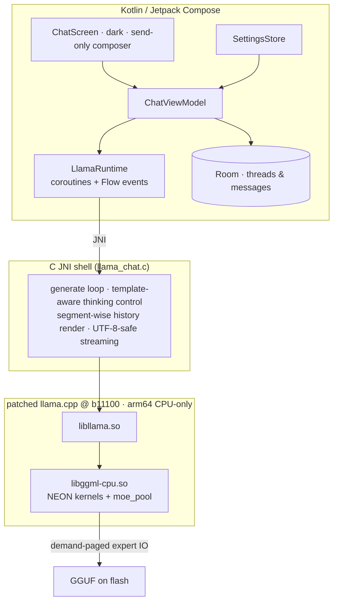

# edge0-android — Guide de compilation de la release

[English](README.md) | [中文](README_zh.md) | [日本語](README_ja.md) | [Español](README_es.md) | Français

Ce document s'adresse aux **développeurs qui compilent ou évaluent l'application Android depuis les sources**. Il couvre : le démarrage rapide (moteur → application → modèles → test), les performances mesurées sur l'appareil de référence et les choix techniques derrière la stack.

edge0 est publié sous forme de **monorepo** — [`Edge0-AI/edge0`](https://github.com/Edge0-AI/edge0) — dont le niveau supérieur contient l'approvisionnement partagé du moteur (`vendor.llama.pin` + le `vendor/llama.cpp` matérialisé par les scripts, les jeux de bandes `patches/llama.cpp/`) et les sous-projets par plateforme (`windows/` = le compagnon de bureau, `android/` = cette application). L'inférence s'exécute sur une version épinglée de llama.cpp upstream, patchée sous forme d'un jeu de patchs rejouable, entièrement sur CPU avec des kernels ARM-NEON et un pool d'experts paginé à la demande.

Attribution tierce : voir `NOTICE` dans ce répertoire. Cartes de modèles : [Edge0/Edge0-8B-A1B-preview](https://huggingface.co/Edge0/Edge0-8B-A1B-preview) · [Edge0/Edge0-35B-A3B-preview](https://huggingface.co/Edge0/Edge0-35B-A3B-preview).

---

## 1. Démarrage rapide

### 1.1 Prérequis

| composant | exigence |
|---|---|
| Appareil | arm64-v8a, Android 13+ (API 33) ; Snapdragon 8 Elite ou équivalent recommandé |
| RAM | 8 GB+ pour le 8B ; 12–16 GB pour le 35B (pagination des experts, voir §3.2) |
| Chaîne d'outils | JDK 17+, Android SDK 35, **NDK r28** (`28.2.13676358`), CMake ≥ 3.21 + Ninja |
| Python | 3.10+ avec `numpy` (convertisseur de modèles, exécuté depuis le `windows/tools` voisin) |
| Disque | ≥ 30 GB libres pour les sources des modèles et les compilations GGUF converties |

Le NDK ne fait **pas** partie de ce dépôt — installez-le une fois (Android Studio :
*Android SDK → SDK Tools → NDK (Side by side)*, ou via la CLI) :

```bash
sdkmanager --install "ndk;28.2.13676358"
```

Pointez ensuite la compilation dessus avec `NDK_DIR` (ou un `ANDROID_NDK_HOME`
exporté) : `build_vendor_libs.sh` lit la chaîne de compilation **et** le runtime
`libomp.so` qu'il met en place (§1.2) depuis cette installation NDK ; un NDK
manquant échoue immédiatement avec cette indication plutôt que de produire un
jeu de bibliothèques cassé.

### 1.2 Compiler le moteur

Les bibliothèques natives proviennent de l'arborescence upstream épinglée, avec
les bandes de patchs de cette plateforme rejouées dans un worktree isolé —
l'arborescence vendor n'est **jamais patchée en place** :

```bash
git clone https://github.com/Edge0-AI/edge0
cd edge0/android
bash tools/llama/build_vendor_libs.sh
```

Le script rejoue `../patches/llama.cpp/{common,android}` (6 + 14 bandes) sur
l'arborescence llama.cpp épinglée — l'épingle se trouve dans
`../vendor.llama.pin` (actuellement `7ab4ee7`, tag b11100) ; l'arborescence
n'est **pas** un sous-module, elle est donc clonée depuis upstream au premier
lancement dans `../vendor/llama.cpp` (ignoré par git ; définissez
`EDGE0_LLAMA_URL` pour utiliser un miroir) et détachée sur l'épingle. Les
rejeux se produisent dans un worktree consommateur ignoré par git, le script
vérifie le hash de l'arborescence résultat attendue (golden) et produit les
quatre bibliothèques partagées du moteur (plus le runtime NDK `libomp.so` dont
`libggml-cpu` a besoin) avec les en-têtes dans `build-dl/llama-libs/` (le point
de mise en place jniLibs de l'application). `--replay` réapplique les bandes
après modification des patchs ; arborescence différente ⇒ ROUGE, la
compilation refuse de démarrer. Cette étape est requise une fois avant la
compilation de l'application — le plugin Gradle lit ces bibliothèques depuis
`build-dl/llama-libs/`.

### 1.3 Compiler et installer l'application

```bash
./gradlew :app:assembleDebug
./gradlew :app:installDebug        # or adb install -r app/build/outputs/apk/debug/app-debug.apk
```

### 1.4 Modèles

Les compilations GGUF sont produites localement à partir des checkpoints
publiés — tout reste sous le `models/` de ce répertoire (ignoré par git) :

```bash
huggingface-cli download Edge0/Edge0-8B-A1B-preview --local-dir models/edge0-8b
python ../windows/tools/convert_mlx_to_gguf.py --dir models/edge0-8b
#  → models/edge0-8b-gguf/{edge0-8b.gguf, lora_edge0_8b-gguf.gguf, manifest.json}

huggingface-cli download Edge0/Edge0-35B-A3B-preview --local-dir models/edge0-35b
python ../windows/tools/convert_mlx_to_gguf.py --dir models/edge0-35b

bash tools/model/push_models.sh --all    # md5-gated staging onto the device
```

Le convertisseur n'a besoin que de python3 + numpy (pas de runtime MLX/torch —
« MLX » désigne la disposition sur disque du checkpoint). Il exécute le repack
r3 avec des portes de parité numérique et émet un manifeste sha256 ; une
conversion correcte reproduit octet pour octet les checksums de référence
listées dans `push_models.sh`. Les modèles peuvent aussi être copiés dans
`files/models/` avec le sélecteur intégré à l'application.

### 1.5 Exécution

Lancez **Edge0 Chat**. La barre de titre affiche le modèle actif (8B / 35B), le
bouton en haut à droite permet d'en changer. La zone de saisie sert uniquement
à envoyer ; la température, la réflexion (thinking) et le prompt système se
trouvent dans les paramètres du tiroir. Chaque réponse comporte une ligne de
métriques inline : `tokens · TTFT · prefill t/s · decode t/s · RSS`.

### 1.6 Tester

Régression instrumentée (nécessite les deux modèles mis en place —
réinstaller l'APK de test efface les données de l'application, replacez donc
les modèles juste avant l'exécution) :

```bash
./gradlew :app:installDebugAndroidTest
bash tools/model/push_models.sh --all
adb shell am instrument -w -e class dev.edge0.runtime.app.LlamaRuntimeTest \
  dev.edge0.runtime.app.test/androidx.test.runner.AndroidJUnitRunner
# expected: OK (8 tests), ~7 min on the reference device
```

Couverture : smoke 8B/35B, commutation 35B↔8B dans le même processus,
fidélité de la réutilisation de préfixe, quadrants thinking activé/désactivé ×
prompt système (porte 8B + sonde de fuite 35B désactivée), et rétention
d'identité à travers le rendu multi-tours. Tests logiques côté hôte :
`./gradlew :app:testDebugUnitTest` (26 tests, aucun appareil requis).

---

## 2. Performances

Appareil de référence : **Lenovo TB322FC (Snapdragon 8 Elite, 16 GB RAM)**,
configuration de série, fenêtres soutenues (premiers segments = fréquences
boost, fin = régime thermique stable — les deux sont rapportés plutôt que des
pics triés sur le volet).

| Modèle | TTFT (tour à chaud) | Decode | Prefill | RSS de session |
|---|---:|---:|---:|---:|
| **8B** (GGUF classe Q8 + LoRA) | ≈ 1.4 s | 29–32 → ~10 t/s sur une fenêtre de 480 s | ~100 t/s | ≈ 250 MB |
| **35B** (MoE int8 mixte, paginé à la demande) | ≈ 1.1 s à chaud (≈ 10–15 s au tout premier tour d'un nouveau sujet — pool d'experts froid, limité par le flash) | 6–9 t/s dans l'application (9.46 t/s soutenu en CLI) | ~1 s par tour incrémental | budget du pool 2–6 GB ; résident ≪ taille du fichier |

Notes : le « premier tour d'un nouveau sujet » paie le coût du pool froid —
par exemple, une question de 55 tokens a mesuré un prefill de 12,8 s avec
25 956 chargements d'experts, 73 % du temps total passé en attente d'E/S
flash ; c'est la pagination à la demande qui fonctionne comme prévu, pas une
régression. À partir du deuxième tour, tout est à chaud : la réutilisation du
préfixe KV + le remplissage keepwarm ramènent le TTFT à ~1 s. La décroissance
du decode le long d'une longue fenêtre est le comportement DVFS/thermique sur
ce SoC.

---

## 3. Détails techniques

### 3.1 Architecture



### 3.2 Pourquoi un MoE de 21,7 GB tient sur un téléphone — `moe_pool`

Le modèle 35B n'active qu'un sous-ensemble mobile de ses 256 experts par
couche et par token, de sorte que la conception livrée pagine les experts **à
la demande** depuis le flash au lieu de la mémoire résidente
(`ggml/src/ggml-cpu/moe_pool.c`, développé comme la bande android de
14 patchs) : cadres privés recopiés à l'entrée (copy-in), une machine à états
à créneaux égaux, des files d'attente d'E/S en arrière-plan calibrées sur le
débit UFS mesuré, des contrôles pin/blob/trim, un remplissage keepwarm de fin
de tour dans une limite d'octets, et une réinitialisation complète
inter-modèles permettant la commutation 8B↔35B à l'intérieur d'un même
processus. Pool désactivé, le moteur résout les lignes d'experts exactement
comme upstream (résolveur NULL ⇒ perturbation nulle, vérifiée par diff des
jeux de symboles). C'est la même famille de mécanismes que le projet de
bureau implémente sur NVMe + Vulkan ; ici, c'est CPU/NEON par conception —
les backends GPU restent hors de la configuration livrée pour garantir un
comportement numérique déterministe et un modèle de mémoire unique.

### 3.3 Structure du dépôt

```
app/                     Android app: Compose UI (src/main/java), JNI shell (src/main/cpp),
                         instrumented + unit tests (src/androidTest, src/test)
tools/llama/             build_vendor_libs.sh — engine rebuild from the pinned tree + bands
tools/model/             push_models.sh — md5-gated model staging to devices
../vendor/llama.cpp/     materialized by the build scripts from vendor.llama.pin (gitignored; never patched in place)
../patches/llama.cpp/    common(6) + android(14) hook-point bands + ledger README
../windows/              desktop companion — hosts the MLX→GGUF converter used in §1.4
```
