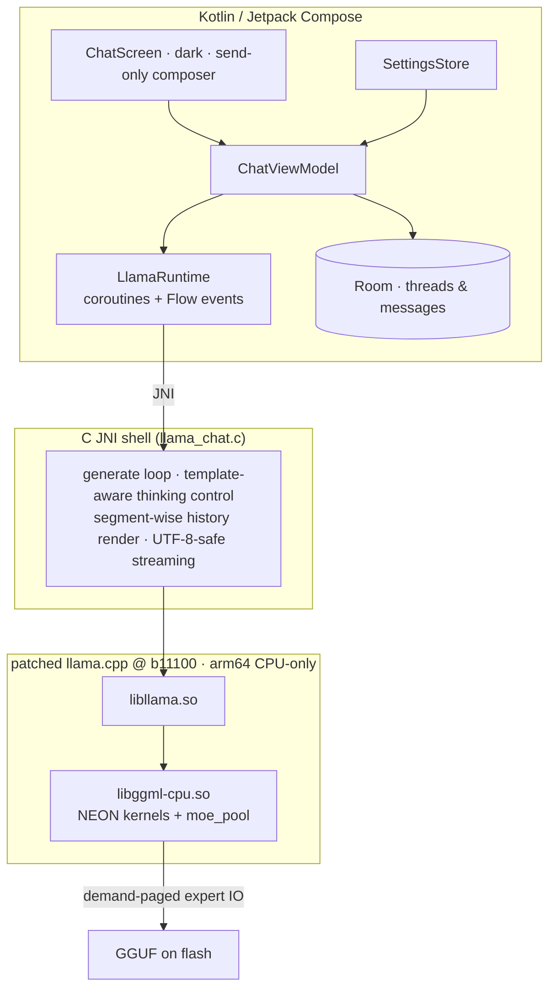

# edge0-android — リリースビルドガイド

[English](README.md) | [中文](README_zh.md) | 日本語 | [Español](README_es.md) | [Français](README_fr.md)

このドキュメントは、**ソースから Android アプリをビルドまたは評価する開発者**向けのものです。内容は、クイックスタート(エンジン → アプリ → モデル → テスト)、リファレンスデバイスでの実測パフォーマンス、そしてスタックの背後にある技術的選択です。

edge0 は**モノレポ**として公開されています — [`Edge0-AI/edge0`](https://github.com/Edge0-AI/edge0) — 最上位階層には共有のエンジンサプライ(`vendor.llama.pin` + スクリプトが実体化する `vendor/llama.cpp`、`patches/llama.cpp/` のバンドセット)とプラットフォームのサブプロジェクト(`windows/` = デスクトップ版コンパニオン、`android/` = 本アプリ)が含まれます。推論はピン留めされた上流の llama.cpp 上で実行され、リプレイ可能なパッチセットとしてパッチが適用され、ARM-NEON カーネルとデマンドページ方式のエキスパートプールにより、完全に CPU 上で動作します。

サードパーティの帰属表示: このディレクトリの `NOTICE` を参照してください。モデルカード: [Edge0/Edge0-8B-A1B-preview](https://huggingface.co/Edge0/Edge0-8B-A1B-preview) · [Edge0/Edge0-35B-A3B-preview](https://huggingface.co/Edge0/Edge0-35B-A3B-preview)。

---

## 1. クイックスタート

### 1.1 前提条件

| コンポーネント | 要件 |
|---|---|
| デバイス | arm64-v8a、Android 13+(API 33);Snapdragon 8 Elite クラスを推奨 |
| RAM | 8 GB+ で 8B が動作;12–16 GB で 35B が動作(エキスパートページング、§3.2 を参照) |
| ツールチェーン | JDK 17+、Android SDK 35、**NDK r28**(`28.2.13676358`)、CMake ≥ 3.21 + Ninja |
| Python | 3.10+ と `numpy`(モデルコンバータ;隣接する `windows/tools` から実行される) |
| ディスク | モデルソースと変換済み GGUF ビルド用に 30 GB 以上の空き容量 |

NDK はこのリポジトリの一部では**ありません** — 一度インストールしてください(Android Studio: *Android SDK → SDK Tools → NDK (Side by side)*、または CLI 経由):

```bash
sdkmanager --install "ndk;28.2.13676358"
```

次に `NDK_DIR`(またはエクスポートされた `ANDROID_NDK_HOME`)でビルドにそれを指定します:
`build_vendor_libs.sh` は、その NDK インストール内からコンパイラツールチェーン**と**、ステージングする `libomp.so` ランタイム(§1.2)を読み取ります。NDK が見つからない場合は、壊れたライブラリセットを生成するのではなく、そのヒントを示して即座に失敗します。

### 1.2 エンジンのビルド

ネイティブライブラリは、ピン留めされた上流ツリーにこのプラットフォームのパッチバンドを隔離されたワークツリーへリプレイして生成されます — ベンダーツリーが**その場でパッチされることは決してありません**:

```bash
git clone https://github.com/Edge0-AI/edge0
cd edge0/android
bash tools/llama/build_vendor_libs.sh
```

スクリプトは `../patches/llama.cpp/{common,android}`(6 + 14 バンド)をピン留めされた llama.cpp ツリーにリプレイします — ピンは `../vendor.llama.pin` にあります(現在 `7ab4ee7`、tag b11100)。このツリーはサブモジュールでは**ない**ため、初回実行時に上流から `../vendor/llama.cpp` にクローンされ(gitignore 済み;ミラーを使うには `EDGE0_LLAMA_URL` を設定)、ピンの位置で detach されます。リプレイは gitignore されたコンシューマーワークツリー内で行われ、スクリプトはゴールデンな結果ツリーハッシュをアサートし、4 つのエンジン共有ライブラリ(および `libggml-cpu` が必要とする NDK の `libomp.so` ランタイム)をヘッダとともに `build-dl/llama-libs/`(アプリの jniLibs ステージングポイント)に生成します。`--replay` はパッチ変更後にバンドを再適用します。ツリーが不一致の場合は RED となり、ビルドは開始を拒否します。このステップはアプリのビルドの前に一度必要です — Gradle プラグインはこれらのライブラリを `build-dl/llama-libs/` から読み取ります。

### 1.3 アプリのビルド & インストール

```bash
./gradlew :app:assembleDebug
./gradlew :app:installDebug        # or adb install -r app/build/outputs/apk/debug/app-debug.apk
```

### 1.4 モデル

GGUF ビルドは公開チェックポイントからローカルで生成されます — すべてのものはこのディレクトリの `models/` 配下に置かれます(gitignore 済み):

```bash
huggingface-cli download Edge0/Edge0-8B-A1B-preview --local-dir models/edge0-8b
python ../windows/tools/convert_mlx_to_gguf.py --dir models/edge0-8b
#  → models/edge0-8b-gguf/{edge0-8b.gguf, lora_edge0_8b-gguf.gguf, manifest.json}

huggingface-cli download Edge0/Edge0-35B-A3B-preview --local-dir models/edge0-35b
python ../windows/tools/convert_mlx_to_gguf.py --dir models/edge0-35b

bash tools/model/push_models.sh --all    # md5-gated staging onto the device
```

コンバータが必要とするのは python3 + numpy のみです(MLX/torch ランタイムは不要 — 「MLX」はディスク上のチェックポイントレイアウトを指します)。数値パリティゲートを備えた r3 リパックを実行し、sha256 マニフェストを出力します。正しい変換は、`push_models.sh` に記載されたベースラインチェックサムをバイト単位で再現します。モデルはアプリ内ピッカーで `files/models/` にコピーすることもできます。

### 1.5 実行

**Edge0 Chat** を起動します。タイトルバーはアクティブなモデル(8B / 35B)を表示し、右上のボタンで切り替えます。コンポーザーは送信専用です。temperature、thinking、システムプロンプトはドロワーの設定にあります。各返信にはインラインのメトリクス行が付きます: `tokens · TTFT · prefill t/s · decode t/s · RSS`。

### 1.6 テスト

計装リグレッションテスト(両モデルのステージングが必要 — テスト APK の再インストールはアプリデータを消去するため、実行直前に再ステージングしてください):

```bash
./gradlew :app:installDebugAndroidTest
bash tools/model/push_models.sh --all
adb shell am instrument -w -e class dev.edge0.runtime.app.LlamaRuntimeTest \
  dev.edge0.runtime.app.test/androidx.test.runner.AndroidJUnitRunner
# expected: OK (8 tests), ~7 min on the reference device
```

カバレッジ: 8B/35B スモーク、35B↔8B のプロセス内切り替え、プレフィックス再利用の忠実性、thinking オン/オフ × システムプロンプトの四象限(8B ゲート + 35B オフ時のリークプローブ)、マルチターンレンダリングを通じたアイデンティティの保持。ホスト側のロジックテスト: `./gradlew :app:testDebugUnitTest`(26 テスト、デバイス不要)。

---

## 2. パフォーマンス

リファレンスデバイス: **Lenovo TB322FC(Snapdragon 8 Elite、16 GB RAM)**、出荷時構成、持続ウィンドウ(最初のセグメント = ブーストクロック、テール = 熱的定常状態 — チェリーピックしたピーク値ではなく両方を報告)。

| モデル | TTFT(ウォームターン) | デコード | プリフィル | セッション RSS |
|---|---:|---:|---:|---:|
| **8B**(Q8 クラス GGUF + LoRA) | ≈ 1.4 s | 480 秒のウィンドウで 29–32 → ~10 t/s | ~100 t/s | ≈ 250 MB |
| **35B**(混合 int8 MoE、デマンドページ方式) | ≈ 1.1 s ウォーム(≈ 10–15 s 新しいトピックの最初のターン — コールドエキスパートプール、フラッシュ律速) | アプリ内 6–9 t/s(CLI 持続値 9.46 t/s) | インクリメンタルターンあたり ~1 s | プールバジェット 2–6 GB;常駐 ≪ ファイルサイズ |

注記: 「新しいトピックの最初のターン」はコールドプールのコストを支払います — 例えば 55 トークンの質問で、プリフィル 12.8 s、エキスパートロード 25956 回、実時間の 73 % がフラッシュ I/O 待ちと測定されました。これはデマンドページングが設計通りに機能しているものであり、リグレッションではありません。2 ターン目以降はウォームです: KV プレフィックスの再利用 + keepwarm リフィルにより、TTFT は約 1 s になります。長いウィンドウに沿ったデコードの減衰は、この SoC の DVFS/熱による挙動です。

---

## 3. 技術詳細

### 3.1 アーキテクチャ



### 3.2 21.7 GB の MoE はなぜスマートフォンに収まるのか — `moe_pool`

35B モデルはトークンごとに、レイヤーあたり 256 のエキスパートのうち移動する部分集合のみをアクティブ化します。そのため出荷時の設計では、エキスパートを常駐メモリではなくフラッシュから**オンデマンドで**ページングします(`ggml/src/ggml-cpu/moe_pool.c`、14 パッチの android バンドとして開発): コピーインのプライベートフレーム、等スロットの状態機械、実測 UFS スループットにチューニングされたバックグラウンド IO ステージングキュー、pin/blob/trim 制御、バイトバジェット内でのターン終了時の keepwarm リフィル、そして 1 つのプロセス内での 8B↔35B 切り替えを可能にする完全なクロスモデルリセット。プールを無効にすると、エンジンは上流とまったく同じようにエキスパート行を解決します(NULL リゾルバー ⇒ ゼロ摂動、シンボルセットの diff により検証済み)。これは、デスクトッププロジェクトが NVMe + Vulkan 上で実装しているものと同じ機構ファミリーです。ここでは設計により CPU/NEON です — 決定的な数値計算と単一のメモリモデルのため、GPU バックエンドは出荷時構成から外されています。

### 3.3 リポジトリマップ

```
app/                     Android app: Compose UI (src/main/java), JNI shell (src/main/cpp),
                         instrumented + unit tests (src/androidTest, src/test)
tools/llama/             build_vendor_libs.sh — engine rebuild from the pinned tree + bands
tools/model/             push_models.sh — md5-gated model staging to devices
../vendor/llama.cpp/     materialized by the build scripts from vendor.llama.pin (gitignored; never patched in place)
../patches/llama.cpp/    common(6) + android(14) hook-point bands + ledger README
../windows/              desktop companion — hosts the MLX→GGUF converter used in §1.4
```
