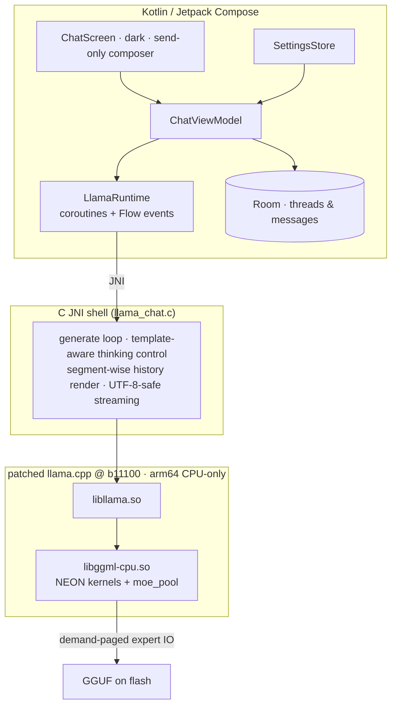

# edge0-android — 发布构建指南

[English](README.md) | 中文 | [日本語](README_ja.md) | [Español](README_es.md) | [Français](README_fr.md)

本文档面向**从源码构建或评估 Android App 的开发者**。内容包括：快速开始（引擎 → App → 模型 → 测试）、参考设备上的性能实测，以及技术栈背后的技术选型。

edge0 以 **monorepo** 形式发布 —— [`Edge0-AI/edge0`](https://github.com/Edge0-AI/edge0) —— 顶层目录存放共享的引擎供给（`vendor.llama.pin` + 由脚本物化的 `vendor/llama.cpp`、`patches/llama.cpp/` 补丁 band 集）与各平台子项目（`windows/` = 桌面伙伴项目，`android/` = 本 App）。推理运行在固定版本（pinned）的上游 llama.cpp 上，以可重放补丁集的方式打补丁，完全在 CPU 上运行，采用 ARM-NEON kernel 与按需分页的专家池。

第三方声明：见本目录下的 `NOTICE`。模型卡：[Edge0/Edge0-8B-A1B-preview](https://huggingface.co/Edge0/Edge0-8B-A1B-preview) · [Edge0/Edge0-35B-A3B-preview](https://huggingface.co/Edge0/Edge0-35B-A3B-preview)。

---

## 1. 快速开始

### 1.1 环境要求

| 组件 | 要求 |
|---|---|
| 设备 | arm64-v8a，Android 13+（API 33）；推荐骁龙 8 Elite 级别 |
| 内存 | 8 GB+ 可运行 8B；12–16 GB 可运行 35B（专家分页，见 §3.2） |
| 工具链 | JDK 17+，Android SDK 35，**NDK r28**（`28.2.13676358`），CMake ≥ 3.21 + Ninja |
| Python | 3.10+ 且带 `numpy`（模型转换器，从同级目录 `windows/tools` 运行） |
| 磁盘 | ≥ 30 GB 可用空间，用于模型源文件与转换后的 GGUF 构建产物 |

NDK **不在**本仓库内 —— 只需安装一次（Android Studio：
*Android SDK → SDK Tools → NDK (Side by side)*，或通过 CLI）：

```bash
sdkmanager --install "ndk;28.2.13676358"
```

然后用 `NDK_DIR`（或导出的 `ANDROID_NDK_HOME`）让构建指向它：
`build_vendor_libs.sh` 会从该 NDK 安装中读取编译器工具链**以及**其暂存
（§1.2）的 `libomp.so` runtime；若缺少 NDK，会按该提示快速失败，而不是
产出损坏的库集合。

### 1.2 构建引擎

原生库来自固定版本的上游源码树，本平台的补丁 band 会被重放到一个隔离的
worktree 中 —— vendor 树**绝不就地打补丁**：

```bash
git clone https://github.com/Edge0-AI/edge0
cd edge0/android
bash tools/llama/build_vendor_libs.sh
```

脚本把 `../patches/llama.cpp/{common,android}`（6 + 14 个 band）重放到
固定版本的 llama.cpp 树上 —— pin 记录在 `../vendor.llama.pin`（当前为
`7ab4ee7`，tag b11100）；该树**不是** submodule，因此首次运行时会从上游
克隆到 `../vendor/llama.cpp`（gitignored；设置 `EDGE0_LLAMA_URL` 可使用
镜像）并 detach 到 pin 的提交。重放发生在一个 gitignored 的消费方
worktree 中，脚本会校验黄金结果树哈希，并产出四个引擎共享库（外加
`libggml-cpu` 所需的 NDK `libomp.so` runtime）与头文件到
`build-dl/llama-libs/`（App 的 jniLibs 暂存点）。补丁变更后用 `--replay`
重新应用 band；树不匹配 ⇒ RED，构建拒绝启动。App 构建前需要执行一次
本步骤 —— Gradle 插件会从 `build-dl/llama-libs/` 读取这些库。

### 1.3 构建并安装 App

```bash
./gradlew :app:assembleDebug
./gradlew :app:installDebug        # or adb install -r app/build/outputs/apk/debug/app-debug.apk
```

### 1.4 模型

GGUF 构建产物由已发布的 checkpoint 在本地生成 —— 全部内容都留在本目录的
`models/` 下（gitignored）：

```bash
huggingface-cli download Edge0/Edge0-8B-A1B-preview --local-dir models/edge0-8b
python ../windows/tools/convert_mlx_to_gguf.py --dir models/edge0-8b
#  → models/edge0-8b-gguf/{edge0-8b.gguf, lora_edge0_8b-gguf.gguf, manifest.json}

huggingface-cli download Edge0/Edge0-35B-A3B-preview --local-dir models/edge0-35b
python ../windows/tools/convert_mlx_to_gguf.py --dir models/edge0-35b

bash tools/model/push_models.sh --all    # md5-gated staging onto the device
```

转换器只需 python3 + numpy（无需 MLX/torch runtime —— “MLX” 指的是磁盘上
的 checkpoint 布局）。它执行带数值一致性校验门的 r3 重打包并输出 sha256
清单；正确的转换会逐字节复现 `push_models.sh` 中列出的基线校验和。也可以
通过 App 内的选择器把模型拷贝到 `files/models/`。

### 1.5 运行

启动 **Edge0 Chat**。标题栏显示当前模型（8B / 35B），右上角按钮用于切换。
输入框只有发送功能；temperature、thinking 与系统提示词在抽屉设置中。每条
回复附带一行内联指标：`tokens · TTFT · prefill t/s · decode t/s · RSS`。

### 1.6 测试

仪器化回归测试（需要两个模型都已就位 —— 重新安装测试 APK 会清空 App
数据，因此请在运行前重新推送模型）：

```bash
./gradlew :app:installDebugAndroidTest
bash tools/model/push_models.sh --all
adb shell am instrument -w -e class dev.edge0.runtime.app.LlamaRuntimeTest \
  dev.edge0.runtime.app.test/androidx.test.runner.AndroidJUnitRunner
# expected: OK (8 tests), ~7 min on the reference device
```

覆盖范围：8B/35B 冒烟、35B↔8B 进程内切换、前缀复用保真度、thinking
开/关 × 系统提示词四象限（8B 开启 + 35B 关闭泄漏探测），以及多轮渲染下的
身份保持。宿主侧逻辑测试：`./gradlew :app:testDebugUnitTest`（26 个测试，
无需设备）。

---

## 2. 性能实测

参考设备：**Lenovo TB322FC（骁龙 8 Elite，16 GB RAM）**，出厂配置，持续
测试窗口（前段 = 加速频率，尾段 = 热稳态 —— 两者都如实报告，而非只挑
峰值）。

| 模型 | TTFT（热轮次） | 解码 | Prefill | 会话 RSS |
|---|---:|---:|---:|---:|
| **8B**（Q8 级 GGUF + LoRA） | ≈ 1.4 s | 480 s 窗口内 29–32 → 约 10 t/s | 约 100 t/s | ≈ 250 MB |
| **35B**（混合 int8 MoE，按需分页） | 热轮次 ≈ 1.1 s（新话题首轮 ≈ 10–15 s —— 专家池冷启动，受闪存 IO 限制） | App 内 6–9 t/s（CLI 持续 9.46 t/s） | 每个增量轮次约 1 s | 池预算 2–6 GB；常驻 ≪ 文件大小 |

说明：“新话题首轮”要付出冷池代价 —— 例如一个 55 token 的问题实测
prefill 12.8 s、25956 次专家加载，73% 的墙钟时间耗在闪存 I/O 等待上；
这是按需分页按设计工作，而非性能回退。第二轮起即为热轮次：KV 前缀复用 +
keepwarm 回填把 TTFT 降到约 1 s。长窗口内解码速度的衰减是该 SoC 上的
DVFS/热行为。

---

## 3. 技术细节

### 3.1 架构



### 3.2 为什么 21.7 GB 的 MoE 能装进手机 —— `moe_pool`

35B 模型每个 token 只激活其每层 256 个专家中一个滚动的子集，因此发布版
设计让专家从闪存**按需**分页，而非驻留内存
（`ggml/src/ggml-cpu/moe_pool.c`，以 14 个补丁的 android band 开发）：
copy-in 私有帧、等槽位状态机、按实测 UFS 吞吐调优的后台 IO 暂存队列、
pin/blob/trim 控制、字节预算内的轮末 keepwarm 回填，以及支持单进程内
8B↔35B 切换的完整跨模型重置。禁用专家池时，引擎解析专家行的行为与上游
完全一致（NULL resolver ⇒ 零扰动，经符号集 diff 验证）。这与桌面项目在
NVMe + Vulkan 上实现的是同一族机制；这里按设计走 CPU/NEON —— GPU 后端
不进入发布配置，以保证确定性数值与单一内存模型。

### 3.3 仓库结构

```
app/                     Android app: Compose UI (src/main/java), JNI shell (src/main/cpp),
                         instrumented + unit tests (src/androidTest, src/test)
tools/llama/             build_vendor_libs.sh — engine rebuild from the pinned tree + bands
tools/model/             push_models.sh — md5-gated model staging to devices
../vendor/llama.cpp/     materialized by the build scripts from vendor.llama.pin (gitignored; never patched in place)
../patches/llama.cpp/    common(6) + android(14) hook-point bands + ledger README
../windows/              desktop companion — hosts the MLX→GGUF converter used in §1.4
```
