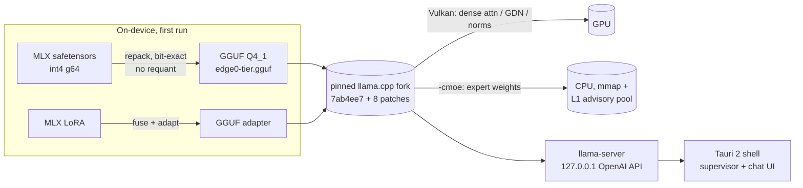
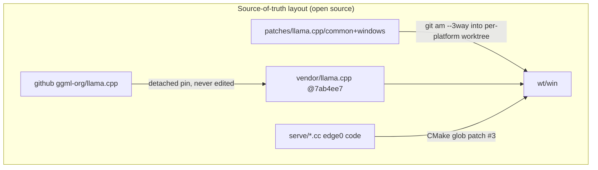

# edge0-windows — Release Build Guide

English | [中文](README_zh.md) | [日本語](README_ja.md) | [Español](README_es.md) | [Français](README_fr.md)

This document is for **developers building or evaluating the Windows app from source**. It covers: quick start (build → run → test), measured performance on the reference machine, and the technical choices behind the stack.

edge0 is published as a **monorepo** — [`Edge0-AI/edge0`](https://github.com/Edge0-AI/edge0) — whose top level holds the shared engine supply (`vendor.llama.pin` + the scripts-materialized `vendor/llama.cpp`, `patches/llama.cpp/` band-sets) and the platform subprojects (`windows/` = this app, `android/` = the companion). Inference runs on pinned upstream llama.cpp, patched as a replayable patch set, with dense compute on Vulkan and MoE expert weights served from CPU.

Third-party attribution: see `NOTICE` in this directory. Model cards: [Edge0/Edge0-8B-A1B-preview](https://huggingface.co/Edge0/Edge0-8B-A1B-preview) · [Edge0/Edge0-35B-A3B-preview](https://huggingface.co/Edge0/Edge0-35B-A3B-preview).

---

## 1. Quick Start

### 1.1 Prerequisites

| toolchain | requirement |
|---|---|
| OS | Windows 10 / 11 x64 |
| Visual Studio 2022 | C++ workload (MSVC) |
| CMake | ≥ 3.21 |
| Vulkan SDK | for `ggml-vulkan` (any AMD/NVIDIA/Intel dGPU; iGPU works but slower) |
| Rust | stable, with `cargo` (Tauri 2 shell) |
| Node.js | LTS (`npm`) |
| Python | 3.10+ with `numpy` (on-device converter + benches) |
| Disk / RAM | ≥ 30 GB free disk; RAM: 8 GB+ runs 8B, 16 GB+ runs 35B (paging-bound), the reference machine is 48 GB |

### 1.2 Build the engine (llama.cpp + patches + edge0 serving code)

```powershell
git clone https://github.com/Edge0-AI/edge0
cd edge0/windows
pwsh -File scripts/vendor-build.ps1        # first build ≈ 10–20 min (compiles llama.cpp + Vulkan kernels)
```

The script resolves the engine depot in two ways, then materializes the supply:

- **monorepo clone (normal path)** → the parent directory carries `vendor.llama.pin` + `patches/llama.cpp/{common,windows}`; the script replays the 8 patches (`git am --3way`) into an isolated build worktree at `../wt/win` (gitignored build area) — the vendor tree itself is **never patched in place**;
- `EDGE0_DEPOT` env → point at an existing depot elsewhere.

The llama.cpp tree is **not** a submodule: on first run the script clones upstream (shallow of blobs) into `../vendor/llama.cpp` and detaches the commit pinned in `vendor.llama.pin`; afterwards that directory is just a gitignored checkout you can refresh with `git fetch`. Set `EDGE0_LLAMA_URL` to clone from a mirror.

`-AssembleOnly` runs everything except compilation (seconds; verifies the patch replay still applies and hashes match). Output:

```
wt\win\build-vk\bin\Release\llama-server.exe   (+ llama.dll, ggml*.dll)
```

### 1.3 Build the app (Tauri installer + portable exe)

```powershell
cd app
npm install
npx tauri build
```

Artifacts:

```
app\src-tauri\target\release\edge0-app.exe                              ← portable, no install
app\src-tauri\target\release\bundle\nsis\edge0_0.1.0_x64-setup.exe      ← NSIS installer
```

The shell locates the engine via `EDGE0_BIN_DIR` (default: the depot engine build dir above — see `app/README.md` env table for the full override surface). Set it if your engine build lives elsewhere.

### 1.4 Models

Nothing to pre-install: the app downloads from HuggingFace on first use, then converts on-device (one-time, ~2–6 min for 8B). Per-file `sha256` is verified against a published manifest and resumable via HTTP Range.

Manual seed (offline machines): place the MLX repo files under

```
~\.edge0\models\edge0-8b\        (chat_template.jinja, model*.safetensors, lora_edge0_8b.safetensors, tokenizer…)
~\.edge0\models\edge0-35b\       (…sharded safetensors, lora_edge0_35b.safetensors…)
```

The converter output is `models\edge0-<tier>-gguf\edge0-<tier>.gguf` + LoRA adapter; conversion is idempotent (sha-gated). Home dir is `EDGE0_HOME` (default `~\.edge0`).

### 1.5 Run the app

Launch `edge0-app.exe` (or install the NSIS package). Typical flow:

1. **Models page** — pick 8B (fast, ~5 GB) or 35B (~21 GB); *Download* → auto *Convert* → *Load*.
2. **Chat page** — streamed Markdown answers; the engine runs as a supervised child process and is killed with the app (Windows Job Object, `KILL_ON_JOB_CLOSE`).
3. **Doctor** (bottom of Models page) — one-click health check: engine binary, model files, disk, env.
4. Troubleshooting: engine/convert logs land in `~\.edge0\logs\`.

Engine API (the app uses it internally, you can point any OpenAI-compatible client at it): `http://127.0.0.1:<port>/v1/chat/completions`, loopback-only. Load params (process contract): `-ngl 99 -cmoe --ctx-size 8192 --flash-attn on --pool-mb <tier×RAM clamp> --mem-budget-mb …`.

### 1.6 Test it

```powershell
cd app\src-tauri
cargo test                                   # fast suite: resume/probe logic against a local fake server

# end-to-end, real model (downloads 4.5 GB if not seeded):
cargo test --test real8b -- --ignored --nocapture

# throughput reproduction (expects the table in §2, ±day-to-day drift):
python ..\..\tools\r3_bench.py --tier 8b
python ..\..\tools\r3_bench.py --tier 35b
```

`r3_bench.py` resolves paths with the same contract as the app: the engine from the depot build dir
(`EDGE0_BIN_DIR` override honored), the converted GGUF from the app's model home (`EDGE0_HOME`,
default `~\.edge0\models`) or a repo-local `models/` when present; results land in `benchmarks/r3/`.

```powershell
# patch-replay gate (no compile, seconds):
pwsh ..\..\scripts\vendor-build.ps1 -AssembleOnly
```

---

## 2. Performance

Reference machine: **Intel i7-14700K · AMD Radeon RX 9070 GRE (Vulkan) · 48 GB DDR5 · Windows 11**, steady-state (`-ngl 99 -cmoe`), bench medians of 3 reps (`tools/r3_bench.py`, ~240-token mixed-language prompt, native context).

| model | prefill (tok/s) | decode (tok/s) | prefill of 240-tok prompt |
|---|---:|---:|---:|
| edge0-8B-A1B | ~212 | ~44.8 | ~1.1 s |
| edge0-35B-A3B | ~70 | ~27.7 | ~3.7 s |

Context to keep when reading these numbers:

- Decode is the *token-generation* rate after the prompt is processed; the A1B / A3B active-parameter counts explain why a 35B model decodes at 27+ tok/s.
- Short prompts are much faster than the 240-token column above: the app's first live request on 8B showed **~0.28 s to first token** for a 17-token prompt (engine log). The app runs with `--ctx-size 8192`; benches above use native context (131k / 262k).
- These are warm-RAM measurements on the 48 GB reference machine (a test bed, not a product assumption). On the 16 GB / 8 GB product tiers, experts are served by mmap page-faults and decode drops with memory pressure; a process-level memory cap (`--mem-budget-mb`) is applied automatically from physical RAM to keep the OS working set sane (it measurably *helps* under pressure).
- Same-condition A/B against unpatched vanilla llama.cpp (vendor tree with the patch bands skipped) shows the patch set costs nothing (8B: 41.5 vs 39.5 decode; 35B: 27.2 vs 27.4 — within machine drift).
- Expect day-to-day drift of a few percent on this class of machine; compare like-for-like, same day, same process if you benchmark.

---

## 3. Technical Details

### 3.1 Architecture





### 3.2 Repo map
```
serve/                 edge0 C++ pieces compiled into libllama (advisory prefetch router, memory budget)
tools/                 MLX→GGUF converter chain (repack + LoRA adapter + catalog) and the throughput bench
app/                   Tauri 2 shell (src-tauri/ Rust, src/ React) — see app/README.md
scripts/               vendor-build.ps1 — engine assembly: patch replay into an isolated worktree
```

The engine changes live at the monorepo root, not in a fork: `vendor/llama.cpp` is the pinned
pristine upstream checkout (never patched in place) and `patches/llama.cpp/` carries the 8
hook-point patches + band README (`common/`, `windows/` here; `android/` for the companion app).
`windows/` deliberately ships **no** nested `patches/` copy — one source of truth, no drift.

### 3.3 Known gaps (as of this release)

- Installer is **unsigned** (SmartScreen warning on first run); no auto-updater yet.
- Engine is not yet bundled inside the installer — portable builds assume the engine build dir; bundling is on the roadmap.
- The `--pool-mb` L1 pool is env-dormant on Windows pending the final memory-tier A/B; the app clamps `--mem-budget-mb` regardless.
- 35B on ≤16 GB machines is functional but paging-bound; documented floor is 8 GB *working with* the memory cap, at reduced tok/s.

---

*Issues and bench results against other hardware welcome — attach `~\.edge0\logs\engine-*.log` and the `doctor` page screenshot.*
