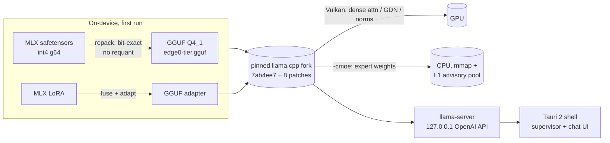
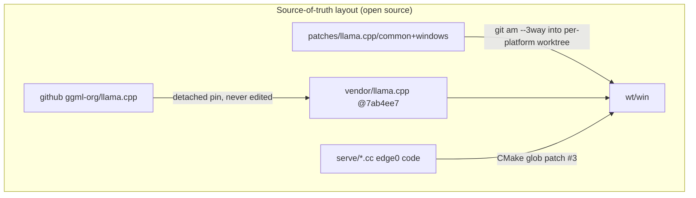

# edge0-windows — Guía de compilación de release

[English](README.md) | [中文](README_zh.md) | [日本語](README_ja.md) | Español | [Français](README_fr.md)

Este documento está dirigido a **desarrolladores que compilan o evalúan la aplicación de Windows desde el código fuente**. Cubre: inicio rápido (compilar → ejecutar → probar), rendimiento medido en la máquina de referencia y las decisiones técnicas detrás del stack.

edge0 se publica como **monorepo** — [`Edge0-AI/edge0`](https://github.com/Edge0-AI/edge0) — cuyo nivel superior contiene el suministro compartido del motor (`vendor.llama.pin` + el `vendor/llama.cpp` materializado por los scripts, los conjuntos de bandas de `patches/llama.cpp/`) y los subproyectos de plataforma (`windows/` = esta aplicación, `android/` = el complemento). La inferencia se ejecuta sobre una versión fijada (pin) de llama.cpp upstream, parcheada como un conjunto de parches reejecutable, con cómputo denso en Vulkan y pesos de expertos MoE servidos desde la CPU.

Atribución de terceros: consulta `NOTICE` en este directorio. Fichas de modelo: [Edge0/Edge0-8B-A1B-preview](https://huggingface.co/Edge0/Edge0-8B-A1B-preview) · [Edge0/Edge0-35B-A3B-preview](https://huggingface.co/Edge0/Edge0-35B-A3B-preview).

---

## 1. Inicio rápido

### 1.1 Requisitos previos

| toolchain | requisito |
|---|---|
| SO | Windows 10 / 11 x64 |
| Visual Studio 2022 | carga de trabajo C++ (MSVC) |
| CMake | ≥ 3.21 |
| Vulkan SDK | para `ggml-vulkan` (cualquier dGPU AMD/NVIDIA/Intel; la iGPU funciona pero es más lenta) |
| Rust | stable, con `cargo` (shell de Tauri 2) |
| Node.js | LTS (`npm`) |
| Python | 3.10+ con `numpy` (conversor en el dispositivo + benchmarks) |
| Disco / RAM | ≥ 30 GB de disco libre; RAM: 8 GB+ ejecuta 8B, 16 GB+ ejecuta 35B (limitado por paginación), la máquina de referencia tiene 48 GB |

### 1.2 Compilar el motor (llama.cpp + parches + código de servicio de edge0)

```powershell
git clone https://github.com/Edge0-AI/edge0
cd edge0/windows
pwsh -File scripts/vendor-build.ps1        # first build ≈ 10–20 min (compiles llama.cpp + Vulkan kernels)
```

El script resuelve el depósito del motor de dos formas y después materializa el suministro:

- **clon del monorepo (ruta normal)** → el directorio padre contiene `vendor.llama.pin` + `patches/llama.cpp/{common,windows}`; el script reejecuta los 8 parches (`git am --3way`) en un worktree de compilación aislado en `../wt/win` (área de compilación ignorada por git) — el árbol del vendor en sí **nunca** se parchea in situ;
- variable de entorno `EDGE0_DEPOT` → apunta a un depósito existente en otra ubicación.

El árbol de llama.cpp **no** es un submódulo: en la primera ejecución el script clona upstream (shallow de blobs) en `../vendor/llama.cpp` y hace detach del commit fijado en `vendor.llama.pin`; después, ese directorio es simplemente un checkout ignorado por git que puedes refrescar con `git fetch`. Establece `EDGE0_LLAMA_URL` para clonar desde un mirror.

`-AssembleOnly` ejecuta todo menos la compilación (segundos; verifica que la reejecución de los parches sigue aplicando y que los hashes coinciden). Salida:

```
wt\win\build-vk\bin\Release\llama-server.exe   (+ llama.dll, ggml*.dll)
```

### 1.3 Compilar la aplicación (instalador de Tauri + exe portable)

```powershell
cd app
npm install
npx tauri build
```

Artefactos:

```
app\src-tauri\target\release\edge0-app.exe                              ← portable, no install
app\src-tauri\target\release\bundle\nsis\edge0_0.1.0_x64-setup.exe      ← NSIS installer
```

El shell localiza el motor mediante `EDGE0_BIN_DIR` (por defecto: el directorio de compilación del motor del depósito indicado arriba — consulta la tabla de variables de entorno en `app/README.md` para ver todas las opciones de sobrescritura). Establécelo si tu compilación del motor está en otra ubicación.

### 1.4 Modelos

Nada que preinstalar: la aplicación descarga desde HuggingFace en el primer uso y después convierte en el dispositivo (una sola vez, ~2–6 min para 8B). El `sha256` de cada archivo se verifica contra un manifiesto publicado y la descarga se puede reanudar mediante HTTP Range.

Precarga manual (máquinas sin conexión): coloca los archivos del repositorio MLX en

```
~\.edge0\models\edge0-8b\        (chat_template.jinja, model*.safetensors, lora_edge0_8b.safetensors, tokenizer…)
~\.edge0\models\edge0-35b\       (…sharded safetensors, lora_edge0_35b.safetensors…)
```

La salida del conversor es `models\edge0-<tier>-gguf\edge0-<tier>.gguf` + adaptador LoRA; la conversión es idempotente (controlada por sha). El directorio principal es `EDGE0_HOME` (por defecto `~\.edge0`).

### 1.5 Ejecutar la aplicación

Inicia `edge0-app.exe` (o instala el paquete NSIS). Flujo típico:

1. **Página Modelos** — elige 8B (rápido, ~5 GB) o 35B (~21 GB); *Descargar* → *Convertir* automáticamente → *Cargar*.
2. **Página Chat** — respuestas en Markdown transmitidas en streaming; el motor se ejecuta como un proceso hijo supervisado y se termina junto con la aplicación (Windows Job Object, `KILL_ON_JOB_CLOSE`).
3. **Doctor** (al final de la página Modelos) — chequeo de salud en un clic: binario del motor, archivos de modelos, disco, entorno.
4. Solución de problemas: los logs del motor/conversión quedan en `~\.edge0\logs\`.

API del motor (la aplicación la usa internamente, puedes apuntar a ella cualquier cliente compatible con OpenAI): `http://127.0.0.1:<port>/v1/chat/completions`, solo loopback. Parámetros de carga (contrato del proceso): `-ngl 99 -cmoe --ctx-size 8192 --flash-attn on --pool-mb <tier×RAM clamp> --mem-budget-mb …`.

### 1.6 Probarla

```powershell
cd app\src-tauri
cargo test                                   # fast suite: resume/probe logic against a local fake server

# end-to-end, real model (downloads 4.5 GB if not seeded):
cargo test --test real8b -- --ignored --nocapture

# throughput reproduction (expects the table in §2, ±day-to-day drift):
python ..\..\tools\r3_bench.py --tier 8b
python ..\..\tools\r3_bench.py --tier 35b
```

`r3_bench.py` resuelve las rutas con el mismo contrato que la aplicación: el motor desde el directorio de compilación del depósito (se respeta la sobrescritura `EDGE0_BIN_DIR`), el GGUF convertido desde el directorio principal de modelos de la aplicación (`EDGE0_HOME`, por defecto `~\.edge0\models`) o un `models/` local del repositorio si existe; los resultados quedan en `benchmarks/r3/`.

```powershell
# patch-replay gate (no compile, seconds):
pwsh ..\..\scripts\vendor-build.ps1 -AssembleOnly
```

---

## 2. Rendimiento

Máquina de referencia: **Intel i7-14700K · AMD Radeon RX 9070 GRE (Vulkan) · 48 GB DDR5 · Windows 11**, estado estacionario (`-ngl 99 -cmoe`), medianas de benchmarks de 3 repeticiones (`tools/r3_bench.py`, prompt mixto de idiomas de ~240 tokens, contexto nativo).

| modelo | prefill (tok/s) | decode (tok/s) | prefill de un prompt de 240 tokens |
|---|---:|---:|---:|
| edge0-8B-A1B | ~212 | ~44.8 | ~1.1 s |
| edge0-35B-A3B | ~70 | ~27.7 | ~3.7 s |

Contexto a tener en cuenta al leer estas cifras:

- Decode es la tasa de *generación de tokens* después de procesar el prompt; el número de parámetros activos de A1B / A3B explica por qué un modelo de 35B decodifica a más de 27 tok/s.
- Los prompts cortos son mucho más rápidos que la columna de 240 tokens de arriba: la primera petición en vivo de la aplicación con 8B mostró **~0.28 s hasta el primer token** para un prompt de 17 tokens (log del motor). La aplicación se ejecuta con `--ctx-size 8192`; los benchmarks anteriores usan contexto nativo (131k / 262k).
- Son mediciones con RAM caliente en la máquina de referencia de 48 GB (un banco de pruebas, no un supuesto del producto). En los niveles de producto de 16 GB / 8 GB, los expertos se sirven mediante fallos de página mmap y el decode cae con la presión de memoria; se aplica automáticamente un límite de memoria a nivel de proceso (`--mem-budget-mb`) a partir de la RAM física para mantener el conjunto de trabajo del SO bajo control (de forma medible *ayuda* bajo presión).
- Una comparación A/B en las mismas condiciones frente a llama.cpp vanilla sin parchear (árbol del vendor omitiendo las bandas de parches) muestra que el conjunto de parches no cuesta nada (8B: 41.5 vs 39.5 en decode; 35B: 27.2 vs 27.4 — dentro de la deriva de la máquina).
- Espera una deriva diaria de unos pocos puntos porcentuales en esta clase de máquina; si haces benchmarks, compara en igualdad de condiciones, el mismo día y el mismo proceso.

---

## 3. Detalles técnicos

### 3.1 Arquitectura





### 3.2 Mapa del repositorio
```
serve/                 edge0 C++ pieces compiled into libllama (advisory prefetch router, memory budget)
tools/                 MLX→GGUF converter chain (repack + LoRA adapter + catalog) and the throughput bench
app/                   Tauri 2 shell (src-tauri/ Rust, src/ React) — see app/README.md
scripts/               vendor-build.ps1 — engine assembly: patch replay into an isolated worktree
```

Los cambios del motor viven en la raíz del monorepo, no en un fork: `vendor/llama.cpp` es el checkout upstream prístino fijado (nunca parcheado in situ) y `patches/llama.cpp/` contiene los 8 parches de puntos de anclaje + el README de bandas (`common/`, `windows/` aquí; `android/` para la aplicación complementaria). `windows/` no incluye deliberadamente **ninguna** copia anidada de `patches/` — una única fuente de verdad, sin deriva.

### 3.3 Limitaciones conocidas (en esta versión)

- El instalador está **sin firmar** (advertencia de SmartScreen en el primer arranque); aún no hay actualizador automático.
- El motor todavía no se incluye dentro del instalador — las compilaciones portables suponen el directorio de compilación del motor; la inclusión está en la hoja de ruta.
- El pool L1 de `--pool-mb` está desactivado por variable de entorno en Windows a la espera del A/B definitivo por niveles de memoria; la aplicación limita `--mem-budget-mb` de todos modos.
- 35B en máquinas de ≤16 GB es funcional pero está limitado por paginación; el mínimo documentado es 8 GB *funcionando con* el límite de memoria, a tok/s reducidos.

---

*Son bienvenidos los issues y los resultados de benchmarks con otro hardware — adjunta `~\.edge0\logs\engine-*.log` y una captura de la página `doctor`.*
