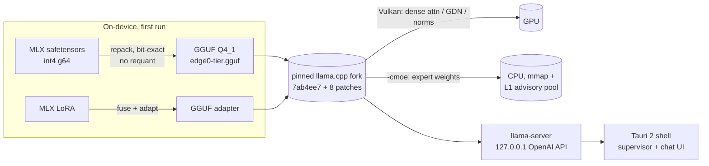
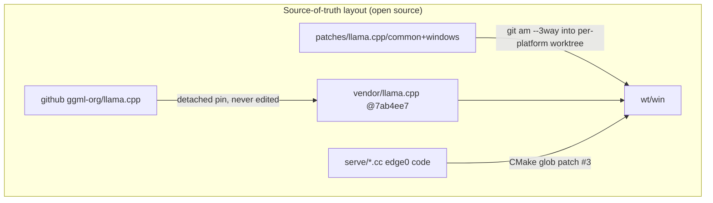

# edge0-windows — Guide de compilation de la release

[English](README.md) | [中文](README_zh.md) | [日本語](README_ja.md) | [Español](README_es.md) | Français

Ce document s'adresse aux **développeurs qui compilent ou évaluent l'application Windows depuis les sources**. Il couvre : le démarrage rapide (compilation → exécution → test), les performances mesurées sur la machine de référence et les choix techniques derrière la stack.

edge0 est publié sous forme de **monorepo** — [`Edge0-AI/edge0`](https://github.com/Edge0-AI/edge0) — dont le niveau supérieur contient l'approvisionnement partagé du moteur (`vendor.llama.pin` + le `vendor/llama.cpp` matérialisé par les scripts, les jeux de bandes `patches/llama.cpp/`) et les sous-projets par plateforme (`windows/` = cette application, `android/` = le compagnon). L'inférence s'exécute sur une version épinglée de llama.cpp upstream, patchée sous forme d'un jeu de patchs rejouable, avec le calcul dense sur Vulkan et les poids d'experts MoE servis depuis le CPU.

Attribution tierce : voir `NOTICE` dans ce répertoire. Cartes de modèles : [Edge0/Edge0-8B-A1B-preview](https://huggingface.co/Edge0/Edge0-8B-A1B-preview) · [Edge0/Edge0-35B-A3B-preview](https://huggingface.co/Edge0/Edge0-35B-A3B-preview).

---

## 1. Démarrage rapide

### 1.1 Prérequis

| chaîne d'outils | exigence |
|---|---|
| OS | Windows 10 / 11 x64 |
| Visual Studio 2022 | charge de travail C++ (MSVC) |
| CMake | ≥ 3.21 |
| Vulkan SDK | pour `ggml-vulkan` (tout dGPU AMD/NVIDIA/Intel ; l'iGPU fonctionne mais plus lentement) |
| Rust | stable, avec `cargo` (shell Tauri 2) |
| Node.js | LTS (`npm`) |
| Python | 3.10+ avec `numpy` (convertisseur sur l'appareil + benches) |
| Disque / RAM | ≥ 30 GB de disque libre ; RAM : 8 GB+ pour le 8B, 16 GB+ pour le 35B (limité par la pagination), la machine de référence est à 48 GB |

### 1.2 Compiler le moteur (llama.cpp + patchs + code de serving edge0)

```powershell
git clone https://github.com/Edge0-AI/edge0
cd edge0/windows
pwsh -File scripts/vendor-build.ps1        # first build ≈ 10–20 min (compiles llama.cpp + Vulkan kernels)
```

Le script résout le dépôt du moteur de deux manières, puis matérialise l'approvisionnement :

- **clone du monorepo (chemin normal)** → le répertoire parent porte `vendor.llama.pin` + `patches/llama.cpp/{common,windows}` ; le script rejoue les 8 patchs (`git am --3way`) dans un worktree de compilation isolé dans `../wt/win` (zone de compilation ignorée par git) — l'arborescence vendor elle-même n'est **jamais patchée en place** ;
- variable d'environnement `EDGE0_DEPOT` → pointe vers un dépôt existant ailleurs.

L'arborescence llama.cpp n'est **pas** un sous-module : au premier lancement, le script clone upstream (shallow en blobs) dans `../vendor/llama.cpp` et détache le commit épinglé dans `vendor.llama.pin` ; ensuite, ce répertoire n'est qu'un checkout ignoré par git que vous pouvez rafraîchir avec `git fetch`. Définissez `EDGE0_LLAMA_URL` pour cloner depuis un miroir.

`-AssembleOnly` exécute tout sauf la compilation (quelques secondes ; vérifie que le rejeu des patchs s'applique toujours et que les hashes correspondent). Sortie :

```
wt\win\build-vk\bin\Release\llama-server.exe   (+ llama.dll, ggml*.dll)
```

### 1.3 Compiler l'application (installeur Tauri + exe portable)

```powershell
cd app
npm install
npx tauri build
```

Artéfacts :

```
app\src-tauri\target\release\edge0-app.exe                              ← portable, no install
app\src-tauri\target\release\bundle\nsis\edge0_0.1.0_x64-setup.exe      ← NSIS installer
```

Le shell localise le moteur via `EDGE0_BIN_DIR` (par défaut : le répertoire de compilation du moteur du dépôt ci-dessus — voir le tableau des variables d'environnement de `app/README.md` pour toutes les options de substitution). Définissez-le si votre compilation du moteur se trouve ailleurs.

### 1.4 Modèles

Rien à préinstaller : l'application télécharge depuis HuggingFace à la première utilisation, puis convertit sur l'appareil (une seule fois, ~2–6 min pour le 8B). Le `sha256` par fichier est vérifié contre un manifeste publié et le téléchargement est reprenable via HTTP Range.

Amorçage manuel (machines hors ligne) : placez les fichiers du dépôt MLX sous

```
~\.edge0\models\edge0-8b\        (chat_template.jinja, model*.safetensors, lora_edge0_8b.safetensors, tokenizer…)
~\.edge0\models\edge0-35b\       (…sharded safetensors, lora_edge0_35b.safetensors…)
```

La sortie du convertisseur est `models\edge0-<tier>-gguf\edge0-<tier>.gguf` + l'adaptateur LoRA ; la conversion est idempotente (contrôlée par sha). Le répertoire personnel est `EDGE0_HOME` (`~\.edge0` par défaut).

### 1.5 Lancer l'application

Lancez `edge0-app.exe` (ou installez le paquet NSIS). Flux typique :

1. **Page Models** — choisissez 8B (rapide, ~5 GB) ou 35B (~21 GB) ; *Download* → *Convert* automatique → *Load*.
2. **Page Chat** — réponses Markdown en streaming ; le moteur s'exécute comme un processus enfant supervisé et est tué avec l'application (Windows Job Object, `KILL_ON_JOB_CLOSE`).
3. **Doctor** (en bas de la page Models) — vérification de santé en un clic : binaire du moteur, fichiers de modèles, disque, environnement.
4. Dépannage : les journaux du moteur/de conversion se trouvent dans `~\.edge0\logs\`.

API du moteur (l'application l'utilise en interne, vous pouvez pointer n'importe quel client compatible OpenAI dessus) : `http://127.0.0.1:<port>/v1/chat/completions`, loopback uniquement. Paramètres de chargement (contrat du processus) : `-ngl 99 -cmoe --ctx-size 8192 --flash-attn on --pool-mb <tier×RAM clamp> --mem-budget-mb …`.

### 1.6 Tester

```powershell
cd app\src-tauri
cargo test                                   # fast suite: resume/probe logic against a local fake server

# end-to-end, real model (downloads 4.5 GB if not seeded):
cargo test --test real8b -- --ignored --nocapture

# throughput reproduction (expects the table in §2, ±day-to-day drift):
python ..\..\tools\r3_bench.py --tier 8b
python ..\..\tools\r3_bench.py --tier 35b
```

`r3_bench.py` résout les chemins avec le même contrat que l'application : le moteur depuis le répertoire de compilation du dépôt
(substitution `EDGE0_BIN_DIR` respectée), le GGUF converti depuis le répertoire personnel des modèles de l'application (`EDGE0_HOME`,
`~\.edge0\models` par défaut) ou un `models/` local au dépôt s'il existe ; les résultats arrivent dans `benchmarks/r3/`.

```powershell
# patch-replay gate (no compile, seconds):
pwsh ..\..\scripts\vendor-build.ps1 -AssembleOnly
```

---

## 2. Performances

Machine de référence : **Intel i7-14700K · AMD Radeon RX 9070 GRE (Vulkan) · 48 GB DDR5 · Windows 11**, régime stable (`-ngl 99 -cmoe`), médianes de bench sur 3 répétitions (`tools/r3_bench.py`, prompt multilingue d'environ 240 tokens, contexte natif).

| modèle | prefill (tok/s) | decode (tok/s) | prefill d'un prompt de 240 tokens |
|---|---:|---:|---:|
| edge0-8B-A1B | ~212 | ~44.8 | ~1.1 s |
| edge0-35B-A3B | ~70 | ~27.7 | ~3.7 s |

Contexte à garder en tête en lisant ces chiffres :

- Le decode est le taux de *génération de tokens* après traitement du prompt ; le nombre de paramètres actifs A1B / A3B explique pourquoi un modèle 35B décode à plus de 27 tok/s.
- Les prompts courts sont bien plus rapides que la colonne 240 tokens ci-dessus : la première requête réelle de l'application sur le 8B a montré **~0,28 s avant le premier token** pour un prompt de 17 tokens (journal du moteur). L'application s'exécute avec `--ctx-size 8192` ; les benches ci-dessus utilisent le contexte natif (131k / 262k).
- Ce sont des mesures à chaud en RAM sur la machine de référence de 48 GB (un banc de test, pas une hypothèse produit). Sur les gammes produit 16 GB / 8 GB, les experts sont servis par des défauts de page mmap et le decode chute avec la pression mémoire ; une limite mémoire au niveau du processus (`--mem-budget-mb`) est appliquée automatiquement à partir de la RAM physique pour garder le jeu de travail de l'OS raisonnable (elle *aide* de façon mesurable sous pression).
- Un A/B dans les mêmes conditions contre llama.cpp vanilla non patché (arborescence vendor avec les bandes de patchs ignorées) montre que le jeu de patchs ne coûte rien (8B : 41,5 contre 39,5 en decode ; 35B : 27,2 contre 27,4 — dans la dérive de la machine).
- Attendez-vous à une dérive de quelques pourcents d'un jour à l'autre sur cette classe de machine ; comparez à conditions égales, le même jour, le même processus, si vous benchmarkez.

---

## 3. Détails techniques

### 3.1 Architecture





### 3.2 Structure du dépôt
```
serve/                 edge0 C++ pieces compiled into libllama (advisory prefetch router, memory budget)
tools/                 MLX→GGUF converter chain (repack + LoRA adapter + catalog) and the throughput bench
app/                   Tauri 2 shell (src-tauri/ Rust, src/ React) — see app/README.md
scripts/               vendor-build.ps1 — engine assembly: patch replay into an isolated worktree
```

Les modifications du moteur se trouvent à la racine du monorepo, pas dans un fork : `vendor/llama.cpp` est le checkout upstream épinglé d'origine (jamais patché en place) et `patches/llama.cpp/` porte les 8
patchs de points d'accroche + le README de bande (`common/`, `windows/` ici ; `android/` pour l'application compagne).
`windows/` n'embarque volontairement **aucune** copie imbriquée de `patches/` — une seule source de vérité, aucune dérive.

### 3.3 Lacunes connues (à la date de cette release)

- L'installeur n'est **pas signé** (avertissement SmartScreen au premier lancement) ; pas encore de mise à jour automatique.
- Le moteur n'est pas encore intégré à l'installeur — les versions portables supposent le répertoire de compilation du moteur ; l'intégration est sur la feuille de route.
- Le pool L1 `--pool-mb` reste en veille sur Windows dans l'attente de l'A/B final sur les niveaux de mémoire ; l'application plafonne `--mem-budget-mb` quoi qu'il en soit.
- Le 35B sur des machines ≤ 16 GB est fonctionnel mais limité par la pagination ; le plancher documenté est 8 GB *avec* le plafond mémoire, à un débit de tok/s réduit.

---

*Les issues et résultats de bench sur d'autres matériels sont les bienvenus — joignez `~\.edge0\logs\engine-*.log` et la capture d'écran de la page `doctor`.*
