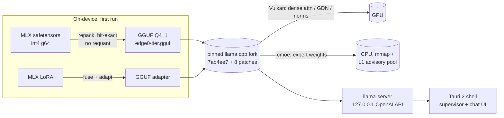
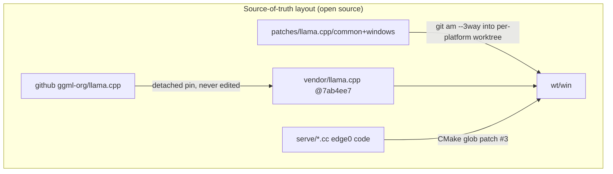

# edge0-windows — リリースビルドガイド

[English](README.md) | [中文](README_zh.md) | 日本語 | [Español](README_es.md) | [Français](README_fr.md)

このドキュメントは、**ソースから Windows アプリをビルドまたは評価する開発者**向けのものです。内容は、クイックスタート(ビルド → 実行 → テスト)、リファレンスマシンでの実測パフォーマンス、そしてスタックの背後にある技術的選択です。

edge0 は**モノレポ**として公開されています — [`Edge0-AI/edge0`](https://github.com/Edge0-AI/edge0) — 最上位階層には共有のエンジンサプライ(`vendor.llama.pin` + スクリプトが実体化する `vendor/llama.cpp`、`patches/llama.cpp/` のバンドセット)とプラットフォームのサブプロジェクト(`windows/` = 本アプリ、`android/` = コンパニオン)が含まれます。推論はピン留めされた上流の llama.cpp 上で実行され、リプレイ可能なパッチセットとしてパッチが適用され、dense 計算は Vulkan 上、MoE エキスパート重みは CPU から供給されます。

サードパーティの帰属表示: このディレクトリの `NOTICE` を参照してください。モデルカード: [Edge0/Edge0-8B-A1B-preview](https://huggingface.co/Edge0/Edge0-8B-A1B-preview) · [Edge0/Edge0-35B-A3B-preview](https://huggingface.co/Edge0/Edge0-35B-A3B-preview)。

---

## 1. クイックスタート

### 1.1 前提条件

| ツールチェーン | 要件 |
|---|---|
| OS | Windows 10 / 11 x64 |
| Visual Studio 2022 | C++ ワークロード(MSVC) |
| CMake | ≥ 3.21 |
| Vulkan SDK | `ggml-vulkan` 用(AMD/NVIDIA/Intel の dGPU ならどれでも;iGPU でも動作するがより遅い) |
| Rust | stable、`cargo` 付き(Tauri 2 シェル) |
| Node.js | LTS(`npm`) |
| Python | 3.10+ と `numpy`(デバイス上コンバータ + ベンチ) |
| ディスク / RAM | 30 GB 以上の空きディスク;RAM: 8 GB+ で 8B、16 GB+ で 35B が動作(ページング律速);リファレンスマシンは 48 GB |

### 1.2 エンジンのビルド(llama.cpp + パッチ + edge0 サービングコード)

```powershell
git clone https://github.com/Edge0-AI/edge0
cd edge0/windows
pwsh -File scripts/vendor-build.ps1        # first build ≈ 10–20 min (compiles llama.cpp + Vulkan kernels)
```

スクリプトはエンジンデポを 2 つの方法で解決し、サプライを実体化します:

- **モノレポのクローン(通常のパス)** → 親ディレクトリが `vendor.llama.pin` + `patches/llama.cpp/{common,windows}` を持ちます。スクリプトは 8 つのパッチ(`git am --3way`)を `../wt/win` の隔離されたビルドワークツリーにリプレイします(gitignore されたビルド領域)— ベンダーツリー自体は**決してその場でパッチされません**;
- `EDGE0_DEPOT` 環境変数 → 他の場所にある既存のデポを指定します。

llama.cpp ツリーはサブモジュールでは**ありません**: 初回実行時、スクリプトは上流を(blobs の shallow クローンで)`../vendor/llama.cpp` にクローンし、`vendor.llama.pin` にピン留めされたコミットを detach します。以降、そのディレクトリは `git fetch` で更新できる、gitignore された単なるチェックアウトです。ミラーからクローンするには `EDGE0_LLAMA_URL` を設定します。

`-AssembleOnly` はコンパイル以外のすべてを実行します(数秒;パッチのリプレイが今も適用可能でハッシュが一致することを検証します)。出力:

```
wt\win\build-vk\bin\Release\llama-server.exe   (+ llama.dll, ggml*.dll)
```

### 1.3 アプリのビルド(Tauri インストーラ + ポータブル exe)

```powershell
cd app
npm install
npx tauri build
```

成果物:

```
app\src-tauri\target\release\edge0-app.exe                              ← portable, no install
app\src-tauri\target\release\bundle\nsis\edge0_0.1.0_x64-setup.exe      ← NSIS installer
```

シェルは `EDGE0_BIN_DIR` 経由でエンジンを特定します(デフォルト: 上記のデポのエンジンビルドディレクトリ — 完全なオーバーライド一覧は `app/README.md` の環境変数テーブルを参照)。エンジンビルドが他の場所にある場合は設定してください。

### 1.4 モデル

事前インストールは不要です: アプリは初回使用時に HuggingFace からダウンロードし、その後デバイス上で変換します(一度きり;8B で約 2〜6 分)。ファイルごとの `sha256` が公開マニフェストと照合して検証され、HTTP Range 経由で再開可能です。

手動シード(オフラインマシン): MLX リポジトリのファイルを以下に配置します

```
~\.edge0\models\edge0-8b\        (chat_template.jinja, model*.safetensors, lora_edge0_8b.safetensors, tokenizer…)
~\.edge0\models\edge0-35b\       (…sharded safetensors, lora_edge0_35b.safetensors…)
```

コンバータの出力は `models\edge0-<tier>-gguf\edge0-<tier>.gguf` + LoRA アダプタです。変換は冪等です(sha ゲート付き)。ホームディレクトリは `EDGE0_HOME`(デフォルト `~\.edge0`)です。

### 1.5 アプリの実行

`edge0-app.exe` を起動します(または NSIS パッケージをインストール)。典型的なフロー:

1. **Models ページ** — 8B(高速、約 5 GB)または 35B(約 21 GB)を選択;*Download* → 自動で *Convert* → *Load*。
2. **Chat ページ** — ストリーミングされる Markdown の回答。エンジンは監督付きの子プロセスとして実行され、アプリとともに kill されます(Windows Job Object、`KILL_ON_JOB_CLOSE`)。
3. **Doctor**(Models ページの下部)— ワンクリックのヘルスチェック: エンジンバイナリ、モデルファイル、ディスク、環境変数。
4. トラブルシューティング: エンジン/変換のログは `~\.edge0\logs\` に出力されます。

エンジン API(アプリが内部的に使用しています;任意の OpenAI 互換クライアントから指定できます): `http://127.0.0.1:<port>/v1/chat/completions`、ループバック専用。ロードパラメータ(プロセスコントラクト): `-ngl 99 -cmoe --ctx-size 8192 --flash-attn on --pool-mb <tier×RAM clamp> --mem-budget-mb …`。

### 1.6 テスト

```powershell
cd app\src-tauri
cargo test                                   # fast suite: resume/probe logic against a local fake server

# end-to-end, real model (downloads 4.5 GB if not seeded):
cargo test --test real8b -- --ignored --nocapture

# throughput reproduction (expects the table in §2, ±day-to-day drift):
python ..\..\tools\r3_bench.py --tier 8b
python ..\..\tools\r3_bench.py --tier 35b
```

`r3_bench.py` はアプリと同じコントラクトでパスを解決します: エンジンはデポのビルドディレクトリから(`EDGE0_BIN_DIR` のオーバーライドを尊重)、変換済み GGUF はアプリのモデルホーム(`EDGE0_HOME`、デフォルト `~\.edge0\models`)から、または存在する場合はリポジトリローカルの `models/` から。結果は `benchmarks/r3/` に出力されます。

```powershell
# patch-replay gate (no compile, seconds):
pwsh ..\..\scripts\vendor-build.ps1 -AssembleOnly
```

---

## 2. パフォーマンス

リファレンスマシン: **Intel i7-14700K · AMD Radeon RX 9070 GRE(Vulkan)· 48 GB DDR5 · Windows 11**、定常状態(`-ngl 99 -cmoe`)、3 回実行のベンチ中央値(`tools/r3_bench.py`、約 240 トークンの言語混在プロンプト、ネイティブコンテキスト)。

| モデル | プリフィル (tok/s) | デコード (tok/s) | 240 トークンプロンプトのプリフィル |
|---|---:|---:|---:|
| edge0-8B-A1B | ~212 | ~44.8 | ~1.1 s |
| edge0-35B-A3B | ~70 | ~27.7 | ~3.7 s |

これらの数値を読む際に念頭に置くべきコンテキスト:

- デコードはプロンプト処理後の*トークン生成*レートです。A1B / A3B のアクティブパラメータ数が、35B モデルが 27+ tok/s でデコードできる理由を説明します。
- 短いプロンプトは上記の 240 トークンの列よりはるかに高速です: 8B でのアプリの最初のライブリクエストは、17 トークンのプロンプトで**最初のトークンまで約 0.28 s** を示しました(エンジンログ)。アプリは `--ctx-size 8192` で実行されます;上記のベンチはネイティブコンテキスト(131k / 262k)を使用しています。
- これらは 48 GB リファレンスマシンでのウォーム RAM の測定値です(テストベッドであり、製品としての前提ではありません)。16 GB / 8 GB の製品ティアでは、エキスパートは mmap のページフォルトによって供給され、メモリプレッシャーに応じてデコードが低下します。プロセスレベルのメモリ上限(`--mem-budget-mb`)が物理 RAM から自動的に適用され、OS のワーキングセットを健全に保ちます(プレッシャー下では測定可能なほど*役立ちます*)。
- パッチ未適用の素の llama.cpp(パッチバンドをスキップしたベンダーツリー)との同一条件での A/B 比較は、パッチセットのコストがゼロであることを示しています(8B: デコード 41.5 vs 39.5;35B: 27.2 vs 27.4 — マシンのドリフトの範囲内)。
- このクラスのマシンでは数パーセントの日ごとのドリフトが予想されます。ベンチマークを行う場合は、同一条件で、同じ日に、同じプロセスで比較してください。

---

## 3. 技術詳細

### 3.1 アーキテクチャ





### 3.2 リポジトリマップ
```
serve/                 edge0 C++ pieces compiled into libllama (advisory prefetch router, memory budget)
tools/                 MLX→GGUF converter chain (repack + LoRA adapter + catalog) and the throughput bench
app/                   Tauri 2 shell (src-tauri/ Rust, src/ React) — see app/README.md
scripts/               vendor-build.ps1 — engine assembly: patch replay into an isolated worktree
```

エンジンの変更はフォークではなくモノレポのルートにあります: `vendor/llama.cpp` はピン留めされた手付かずの上流チェックアウト(決してその場でパッチされない)であり、`patches/llama.cpp/` が 8 つのフックポイントパッチ + バンド README(`common/` と `windows/` はここ;コンパニオンアプリ用は `android/`)を保持します。`windows/` は意図的にネストした `patches/` のコピーを**一切**同梱しません — 信頼できる単一のソース、ドリフトなし。

### 3.3 既知のギャップ(本リリース時点)

- インストーラは**未署名**です(初回実行時に SmartScreen の警告)。自動アップデータはまだありません。
- エンジンはまだインストーラ内にバンドルされていません — ポータブルビルドはエンジンビルドディレクトリを前提とします。バンドルはロードマップ上です。
- `--pool-mb` の L1 プールは、最終的なメモリティア A/B を待つ間、Windows では環境変数レベルで休眠状態です。いずれにせよアプリは `--mem-budget-mb` をクランプします。
- 16 GB 以下のマシンでの 35B は動作しますが、ページング律速です。ドキュメント化された下限は 8 GB で、メモリ上限と*組み合わせる*ことで動作し、tok/s は低下します。

---

*他のハードウェアでの issue やベンチ結果を歓迎します — `~\.edge0\logs\engine-*.log` と `doctor` ページのスクリーンショットを添付してください。*
