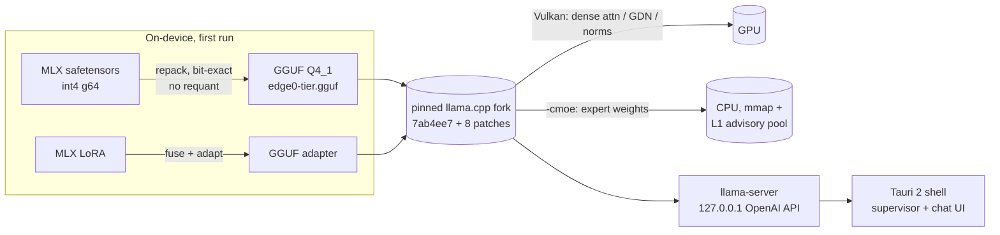
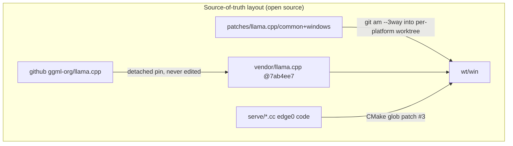

# edge0-windows — 发布构建指南

[English](README.md) | 中文 | [日本語](README_ja.md) | [Español](README_es.md) | [Français](README_fr.md)

本文档面向**从源码构建或评估 Windows App 的开发者**。内容包括：快速开始（构建 → 运行 → 测试）、参考机器上的性能实测，以及技术栈背后的技术选型。

edge0 以 **monorepo** 形式发布 —— [`Edge0-AI/edge0`](https://github.com/Edge0-AI/edge0) —— 顶层目录存放共享的引擎供给（`vendor.llama.pin` + 由脚本物化的 `vendor/llama.cpp`、`patches/llama.cpp/` 补丁 band 集）与各平台子项目（`windows/` = 本 App，`android/` = 伙伴项目）。推理运行在固定版本（pinned）的上游 llama.cpp 上，以可重放补丁集的方式打补丁，稠密计算走 Vulkan，MoE 专家权重由 CPU 供给。

第三方声明：见本目录下的 `NOTICE`。模型卡：[Edge0/Edge0-8B-A1B-preview](https://huggingface.co/Edge0/Edge0-8B-A1B-preview) · [Edge0/Edge0-35B-A3B-preview](https://huggingface.co/Edge0/Edge0-35B-A3B-preview)。

---

## 1. 快速开始

### 1.1 环境要求

| 工具链 | 要求 |
|---|---|
| 系统 | Windows 10 / 11 x64 |
| Visual Studio 2022 | C++ 工作负载（MSVC） |
| CMake | ≥ 3.21 |
| Vulkan SDK | 用于 `ggml-vulkan`（任意 AMD/NVIDIA/Intel 独显；核显可用但更慢） |
| Rust | stable 版，带 `cargo`（Tauri 2 外壳） |
| Node.js | LTS（`npm`） |
| Python | 3.10+ 且带 `numpy`（端上转换器 + 基准测试） |
| 磁盘 / 内存 | ≥ 30 GB 可用磁盘；内存：8 GB+ 可运行 8B，16 GB+ 可运行 35B（受分页限制），参考机器为 48 GB |

### 1.2 构建引擎（llama.cpp + 补丁 + edge0 serving 代码）

```powershell
git clone https://github.com/Edge0-AI/edge0
cd edge0/windows
pwsh -File scripts/vendor-build.ps1        # first build ≈ 10–20 min (compiles llama.cpp + Vulkan kernels)
```

脚本以两种方式解析引擎 depot，然后物化供给：

- **monorepo 克隆（常规路径）** → 父目录带有 `vendor.llama.pin` + `patches/llama.cpp/{common,windows}`；脚本把 8 个补丁（`git am --3way`）重放到 `../wt/win` 的隔离构建 worktree（gitignored 构建区）—— vendor 树本身**绝不就地打补丁**；
- `EDGE0_DEPOT` 环境变量 → 指向别处已有的 depot。

llama.cpp 树**不是** submodule：首次运行时脚本会把上游克隆（blob 浅克隆）到 `../vendor/llama.cpp`，并 detach 到 `vendor.llama.pin` 固定的提交；此后该目录只是一个 gitignored 的 checkout，可用 `git fetch` 刷新。设置 `EDGE0_LLAMA_URL` 可从镜像克隆。

`-AssembleOnly` 运行除编译外的全部步骤（数秒；验证补丁重放仍可应用且哈希匹配）。输出：

```
wt\win\build-vk\bin\Release\llama-server.exe   (+ llama.dll, ggml*.dll)
```

### 1.3 构建 App（Tauri 安装包 + 便携版 exe）

```powershell
cd app
npm install
npx tauri build
```

产物：

```
app\src-tauri\target\release\edge0-app.exe                              ← portable, no install
app\src-tauri\target\release\bundle\nsis\edge0_0.1.0_x64-setup.exe      ← NSIS installer
```

外壳通过 `EDGE0_BIN_DIR` 定位引擎（默认：上文的 depot 引擎构建目录 —— 完整的覆盖项见 `app/README.md` 的环境变量表）。若引擎构建在别处，请设置该变量。

### 1.4 模型

无需预装任何东西：App 首次使用时从 HuggingFace 下载，然后在端上转换（一次性，8B 约 2–6 分钟）。逐文件 `sha256` 会对照已发布清单校验，并支持通过 HTTP Range 断点续传。

手动预置（离线机器）：把 MLX 仓库文件放在

```
~\.edge0\models\edge0-8b\        (chat_template.jinja, model*.safetensors, lora_edge0_8b.safetensors, tokenizer…)
~\.edge0\models\edge0-35b\       (…sharded safetensors, lora_edge0_35b.safetensors…)
```

转换器输出为 `models\edge0-<tier>-gguf\edge0-<tier>.gguf` + LoRA 适配器；转换是幂等的（sha 门控）。主目录为 `EDGE0_HOME`（默认 `~\.edge0`）。

### 1.5 运行 App

启动 `edge0-app.exe`（或安装 NSIS 包）。典型流程：

1. **Models 页面** —— 选择 8B（快，约 5 GB）或 35B（约 21 GB）；*Download* → 自动 *Convert* → *Load*。
2. **Chat 页面** —— 流式 Markdown 回答；引擎作为受监督的子进程运行，并随 App 一起被终止（Windows Job Object，`KILL_ON_JOB_CLOSE`）。
3. **Doctor**（Models 页面底部）—— 一键健康检查：引擎二进制、模型文件、磁盘、环境。
4. 排障：引擎/转换日志位于 `~\.edge0\logs\`。

引擎 API（App 内部使用，任何 OpenAI 兼容客户端都可指向它）：`http://127.0.0.1:<port>/v1/chat/completions`，仅限回环。加载参数（进程契约）：`-ngl 99 -cmoe --ctx-size 8192 --flash-attn on --pool-mb <tier×RAM clamp> --mem-budget-mb …`。

### 1.6 测试

```powershell
cd app\src-tauri
cargo test                                   # fast suite: resume/probe logic against a local fake server

# end-to-end, real model (downloads 4.5 GB if not seeded):
cargo test --test real8b -- --ignored --nocapture

# throughput reproduction (expects the table in §2, ±day-to-day drift):
python ..\..\tools\r3_bench.py --tier 8b
python ..\..\tools\r3_bench.py --tier 35b
```

`r3_bench.py` 以与 App 相同的契约解析路径：引擎取自 depot 构建目录（支持 `EDGE0_BIN_DIR` 覆盖），转换后的 GGUF 取自 App 的模型主目录（`EDGE0_HOME`，默认 `~\.edge0\models`）或存在时的仓库本地 `models/`；结果落在 `benchmarks/r3/`。

```powershell
# patch-replay gate (no compile, seconds):
pwsh ..\..\scripts\vendor-build.ps1 -AssembleOnly
```

---

## 2. 性能实测

参考机器：**Intel i7-14700K · AMD Radeon RX 9070 GRE（Vulkan）· 48 GB DDR5 · Windows 11**，稳态（`-ngl 99 -cmoe`），3 轮基准取中位数（`tools/r3_bench.py`，约 240 token 混合语言 prompt，原生上下文）。

| 模型 | prefill（tok/s） | decode（tok/s） | 240 token prompt 的 prefill |
|---|---:|---:|---:|
| edge0-8B-A1B | ~212 | ~44.8 | ~1.1 s |
| edge0-35B-A3B | ~70 | ~27.7 | ~3.7 s |

阅读这些数字时需要了解的背景：

- decode 是 prompt 处理完成后的 *token 生成*速率；A1B / A3B 的激活参数量解释了为什么 35B 模型能以 27+ tok/s 解码。
- 短 prompt 远快于上表的 240 token 列：App 对 8B 的首个真实请求，17 token 的 prompt **首 token 约 0.28 s**（引擎日志）。App 以 `--ctx-size 8192` 运行；上述基准使用原生上下文（131k / 262k）。
- 这些是 48 GB 参考机器上的热内存实测（它是测试台，不代表产品假设）。在 16 GB / 8 GB 的产品档位上，专家经 mmap 缺页供给，解码速度随内存压力下降；进程级内存上限（`--mem-budget-mb`）会依据物理内存自动施加，以保持操作系统工作集合理（在压力下它确有可测量的*帮助*）。
- 与未打补丁的原版 llama.cpp（跳过补丁 band 的 vendor 树）在同条件下 A/B 对比表明补丁集零开销（8B：decode 41.5 对 39.5；35B：27.2 对 27.4 —— 均在机器波动范围内）。
- 这一级别的机器日间波动可达百分之几；如要跑基准，请在同一天、同一进程内做同类对比。

---

## 3. 技术细节

### 3.1 架构





### 3.2 仓库结构
```
serve/                 edge0 C++ pieces compiled into libllama (advisory prefetch router, memory budget)
tools/                 MLX→GGUF converter chain (repack + LoRA adapter + catalog) and the throughput bench
app/                   Tauri 2 shell (src-tauri/ Rust, src/ React) — see app/README.md
scripts/               vendor-build.ps1 — engine assembly: patch replay into an isolated worktree
```

引擎改动位于 monorepo 根目录，而非某个 fork：`vendor/llama.cpp` 是固定版本的原始上游 checkout（绝不就地打补丁），`patches/llama.cpp/` 承载 8 个 hook-point 补丁 + band README（此处为 `common/`、`windows/`；`android/` 供伙伴 App 使用）。`windows/` 刻意**不**携带嵌套的 `patches/` 副本 —— 单一事实来源，杜绝漂移。

### 3.3 已知缺口（截至本版本）

- 安装包**未签名**（首次运行会有 SmartScreen 警告）；尚无自动更新。
- 引擎尚未打包进安装包 —— 便携版构建假定引擎构建目录存在；打包在路线图中。
- `--pool-mb` L1 池在 Windows 上处于环境休眠状态，等待最终的内存档位 A/B；无论如何 App 都会钳制 `--mem-budget-mb`。
- ≤16 GB 机器上的 35B 可用但受分页限制；文档化的下限是 8 GB *配合*内存上限工作，tok/s 有所降低。

---

*欢迎提交 issue 与其他硬件上的基准结果 —— 请附上 `~\.edge0\logs\engine-*.log` 与 `doctor` 页面截图。*
